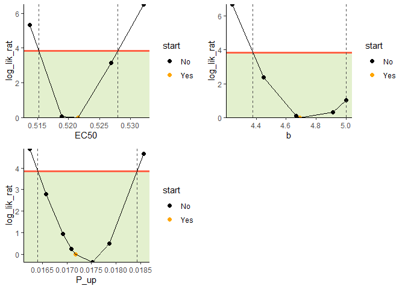

Modeling Howto
================
Nils Kehrein
03 May, 2024

- [How to access scenario
  properties](#how-to-access-scenario-properties)
- [Using *tidyr* syntax](#using-tidyr-syntax)
- [Predictions](#predictions)
- [Moving exposure windows](#moving-exposure-windows)
- [Simulating biomass transfers](#simulating-biomass-transfers)
- [Fitting model parameters](#fitting-model-parameters)
- [Changes in parameter values over
  time](#changes-in-parameter-values-over-time)
- [Decrease assessment runtime](#decrease-assessment-runtime)
- [Implementing custom models](#implementing-custom-models)
- [Complete working example](#complete-working-example)
  - [Setting up a scenario](#setting-up-a-scenario)
  - [Simulating a scenario and
    plotting](#simulating-a-scenario-and-plotting)

This Howto provides instructions on how to address certain modeling
challenges and offers additional details and context for certain
features of the package. A final section provides a complete worked out
example. For a more general overview, please refer to the
[manual](cvasi-1-manual.html).

## How to access scenario properties

The package provides a number of `set*()` functions to modify scenario
properties such as `set_param()` and `set_times()`. Analogous `set*`
functions are not provided because, generally, it should not be
necessary to retrieve data from scenarios. However, it is possible (but
not recommended) to access all scenario settings via objects *slots*. A
*slot* is the name for an object attribute in *R*. The slots of an
object can be accessed by using the `@` operator. It behaves similar to
the `$` operator on named lists:

``` r
# Create a new scenario object
myscenario <- Lemna_Schmitt()

# Get model name
get_model(myscenario)
#> [1] "Lemna_Schmitt"

# Set a custom tag to identify the scenario
myscenario %>%
  set_tag("Lab experiment #1") -> myscenario

# Get custom tag
get_tag(myscenario)
#> [1] "Lab experiment #1"

# The tag is also displayed when printing scenario properties
myscenario
#> 'Lemna_Schmitt' scenario
#> tag  : Lab experiment #1
#> param: Emax=1, AperBM=1000, Kbm=1, P_Temp=0, MolWeight=390.4, k_phot_fix=1, k_phot_max=0.47, k_resp=0.05, k_loss=0, Tmin=8, Tmax=40.5, Topt=26.7, t_ref=25, Q10=2, k_0=3, a_k=5e-05, C_P=0.3, CP50=0.0043, a_P=1, KiP=101, C_N=0.6, CN50=0.034, a_N=1, KiN=604, BM50=176, mass_per_frond=1e-04, BMw2BMd=16.7
#> init : BM=0, E=1, M_int=0
#> endpt: BM, r
#> times: none
#> forcs: none
#> expsr: none
#> >> exposure series is empty

# Accessing scenario slots and their default values
myscenario@forcings.req # forcings required for effect calculations
#> [1] "temp" "rad"
myscenario@endpoints    # available effect endpoints
#> [1] "BM" "r"
myscenario@control.req  # are control runs required for effect calculation?
#> [1] TRUE
```

The previous example displays some of the default values of a
*Lemna_Schmitt* scenario. The set of available slots depends on the
model type and is documented in the package help. For instance, scenario
properties shared by all models are documented in the effect scenario
class:

``` r
# Call the help page of effect scenarios class
?scenarios
```

A scenario class inherits all slots from its ancestors. A notable class
which modifies simulation behavior and provides additional scenario
properties is `Transferable`: it provides capabilities to consider
biomass transfers at defined time points during simulation. Details
about its class slots and functionality are described in the help pages.

``` r
# Call the help page of the biomass transfer class
?Transferable
```

## Using *tidyr* syntax

The *tidyr* syntax, popularized by the *tidyverse* packages in R,
provides a coherent and efficient approach to data manipulation and
analysis. The *tidyverse*, which includes the widely used *dplyr* and
*ggplot2* packages, follows a standardized grammar that makes code more
readable and intuitive. *tidyr* syntax emphasizes the use of functions
with clear and descriptive names. This makes it easier for users to
understand and reproduce analyses. The `%>%` (pipe) operator is a key
component of *tidyr* syntax and enables fluent and expressive
concatenation of operations. Overall, the introduction of *tidyr* syntax
improves code readability, reproducibility, and collaboration, resulting
in maintainable data analysis pipelines.

In brief, the advantages of *tidyr* syntax are:

- a series of statements can be combined to an intuitive workflow using
  the pipeline (`%>%`) operator
- a short cut for the pipe (`%>%`) operator is Ctrl+Shift+M
- pipelines reduce the need for intermediary variables (but thoughtful
  intermediates are recommended)
- *tidy* verbs generally take `list` data types as input and return
  these also as output
- some verbs enrich outputs with additional information, effectively
  extending the output data to a table

``` r
# The example scenario `metsulfuron` based on the Lemna model by Schmitt et al. (2013)
# is modified by setting a new exposure series and initial state. Then, it is
# simulated.
  metsulfuron %>%
    set_noexposure() %>%  # set no exposure (i.e., a control run)
    set_init(c(BM = 50)) %>%  # set initial biomass
    simulate()
#>    time       BM E M_int C_int  FrondNo
#> 1     0 50.00000 1     0     0 500000.0
#> 2     1 52.79250 1     0     0 527925.0
#> 3     2 55.64673 1     0     0 556467.3
#> 4     3 58.55411 1     0     0 585541.1
#> 5     4 61.50533 1     0     0 615053.3
#> 6     5 64.49048 1     0     0 644904.8
#> 7     6 67.49918 1     0     0 674991.8
#> 8     7 70.52071 1     0     0 705207.1
#> 9     8 73.54416 1     0     0 735441.6
#> 10    9 76.55861 1     0     0 765586.1
#> 11   10 79.55324 1     0     0 795532.4
#> 12   11 82.51755 1     0     0 825175.5
#> 13   12 85.44144 1     0     0 854414.4
#> 14   13 88.31537 1     0     0 883153.7
#> 15   14 91.13051 1     0     0 911305.1
```

## Predictions

TKTD models have both species and substance specificity. If risks are
identified at Tier 1 (standard test species approach) and exposure
duration is expected to be shorter than in standard tests, the simplest
solution is to develop TKTD models for standard test species. However,
if Tier 2A (geometric mean/evidence weighting approach) or Tier 2B
(species sensitivity distribution approach) information is available, it
may be more appropriate to develop TKTD models for a wider range of
species to increase the accuracy of the risk assessment. Validated TKTD
models for these different species can be used as an alternative to
assess specific risks using available field exposure profiles. This
includes the calculation of exposure profile specific LPx/EPx values
(multiplication factor for a specific overall exposure profile causing x
% lethality or effect) based on an appropriate aquatic exposure
assessment.

``` r
# Initialize the random numbers generator
set.seed(123)
# Generating a random exposure series spanning 14 days
random_conc <- runif(15, min=0, max=0.1)
exposure_profile <- data.frame(time=0:14, conc=random_conc)
# Run EPx calculations
minnow_it %>%
  set_exposure(exposure_profile) %>%  # set a specific exposure scenario
  epx()  # run EPx calculations
#> # A tibble: 1 × 3
#>   scenario   L.EP10 L.EP50
#>   <list>      <dbl>  <dbl>
#> 1 <GutsRdIt>   67.0   111.
```

## Moving exposure windows

A moving time window is a computing technique used in data analysis.
Data is systematically analysed within a window of fixed length that
moves or slides through the data set, in our case an exposure
time-series. The window captures a subset of successive data points, and
as it moves through the data; simulations and effect calculations are
performed for each window.

`effect()` can report effect levels for all evaluated exposure windows
on demand:

``` r
# Derive effect levels of all exposure windows
metsulfuron %>% 
  set_window(length=7, interval=1) %>%
  effect(max_only=FALSE)
#> # A tibble: 8 × 5
#>   scenario          BM         r dat.start dat.end
#>   <list>         <dbl>     <dbl>     <dbl>   <dbl>
#> 1 <LmnSchmS>  2.68e- 1  9.06e- 1         0       7
#> 2 <LmnSchmS>  2.65e- 1  8.95e- 1         1       8
#> 3 <LmnSchmS>  2.48e- 1  8.29e- 1         2       9
#> 4 <LmnSchmS>  2.05e- 1  6.69e- 1         3      10
#> 5 <LmnSchmS>  1.47e- 1  4.63e- 1         4      11
#> 6 <LmnSchmS>  7.39e- 2  2.23e- 1         5      12
#> 7 <LmnSchmS>  3.15e- 3  9.18e- 3         6      13
#> 8 <LmnSchmS> -6.66e-16 -1.78e-15         7      14
```

The resulting table describes how effect levels change when the exposure
window moves along the exposure series. It is also possible to specify
the marginal effect threshold of reported results (this prevents
overinterpretation of spurious effect levels originating from marginal
numerical errors introduced during simulation), as in the following
example:

``` r
# Only report effect levels larger than 1e-5 = 0.001%
metsulfuron %>% 
  set_window(length=7, interval=1) %>%
  effect(max_only=FALSE, marginal_effect=1e-5)
#> # A tibble: 8 × 5
#>   scenario        BM       r dat.start dat.end
#>   <list>       <dbl>   <dbl>     <dbl>   <dbl>
#> 1 <LmnSchmS> 0.268   0.906           0       7
#> 2 <LmnSchmS> 0.265   0.895           1       8
#> 3 <LmnSchmS> 0.248   0.829           2       9
#> 4 <LmnSchmS> 0.205   0.669           3      10
#> 5 <LmnSchmS> 0.147   0.463           4      11
#> 6 <LmnSchmS> 0.0739  0.223           5      12
#> 7 <LmnSchmS> 0.00315 0.00918         6      13
#> 8 <LmnSchmS> 0       0               7      14
```

The effect over all moving windows can be visualized using `ggplot`:

``` r
set.seed(123)
# Generate a random exposure series spanning 14 days
ts <- data.frame(time = 0:14,
                 conc = runif(15, min=0, max=0.1))

# Run EPx calculations for a window length of 7 days and a step size of 1 day
metsulfuron %>%
  set_exposure(ts) %>%
  set_window(length=7, interval=1) %>%
  effect(max_only=FALSE) -> results
results
#> # A tibble: 8 × 5
#>   scenario          BM        r dat.start dat.end
#>   <list>         <dbl>    <dbl>     <dbl>   <dbl>
#> 1 <LmnSchmS> 0.000113  0.000327         0       7
#> 2 <LmnSchmS> 0.000115  0.000333         1       8
#> 3 <LmnSchmS> 0.000109  0.000317         2       9
#> 4 <LmnSchmS> 0.0000971 0.000283         3      10
#> 5 <LmnSchmS> 0.000104  0.000302         4      11
#> 6 <LmnSchmS> 0.000119  0.000346         5      12
#> 7 <LmnSchmS> 0.000136  0.000394         6      13
#> 8 <LmnSchmS> 0.000116  0.000337         7      14

# Create a plot of effects over time
library(ggplot2)
ggplot(results) +
  geom_point(aes(dat.start, BM*100)) +
  labs(x="Start of window (day)", y="Effect on biomass (%)")
```

<!-- --> The effect plot
shows the effect for the time point where each window starts. Effects
are not available, and therefore not plotted, for time points where the
window exceeds the simulated timeframe.

## Simulating biomass transfers

A transfer refers to an event where a certain amount of biomass (BM) is
moved to a new medium after a period of time. This feature replicates a
procedure occurring e.g. in *Lemna* effect studies and may be necessary
to recreate study results. At each transfer, a defined amount of biomass
is transferred to a new medium. This is modeled by interrupting the
simulation at a transfer time point, modifying the biomass level BM, and
scaling affected compartments according to new biomass levels. Scaling
of compartments depending on biomass, such as internal toxicant mass, is
necessary to correctly reflect mass balances and concentrations over
time.

Option 1: Regular intervals

``` r
metsulfuron %>%
  set_init(c(BM=1)) %>%
  set_noexposure() %>%
  set_transfer(interval=3, biomass=1) %>%
  simulate() -> result
result
#>    time       BM E M_int C_int  FrondNo
#> 1     0 1.000000 1     0     0 10000.00
#> 2     1 1.088182 1     0     0 10881.82
#> 3     2 1.184076 1     0     0 11840.76
#> 4     3 1.288342 1     0     0 12883.42
#> 5     4 1.088182 1     0     0 10881.82
#> 6     5 1.184076 1     0     0 11840.76
#> 7     6 1.288342 1     0     0 12883.42
#> 8     7 1.088182 1     0     0 10881.82
#> 9     8 1.184076 1     0     0 11840.76
#> 10    9 1.288342 1     0     0 12883.42
#> 11   10 1.088182 1     0     0 10881.82
#> 12   11 1.184076 1     0     0 11840.76
#> 13   12 1.288342 1     0     0 12883.42
#> 14   13 1.088182 1     0     0 10881.82
#> 15   14 1.184076 1     0     0 11840.76

library(ggplot2)
ggplot(result) +
  geom_line(aes(time, BM)) +
  labs(x="Time (days)", y="Biomass (g_dw/m2)", title="Biomass transfer every three days")
```

<!-- -->

Option 2: Custom time points and custom biomass

``` r
metsulfuron %>%
  set_init(c(BM=1)) %>%
  set_noexposure() %>%
  set_transfer(times=c(3, 6), biomass=c(1, 0.5)) %>%
  simulate() -> result2

library(ggplot2)
ggplot(result2) +
  geom_line(aes(time, BM)) +
  labs(x="Time (days)", y="Biomass (g_dw/m2)", title="Biomass transfer at custom time points")
```

<!-- -->

``` r
# Call the help page of set_transfer
?set_transfer
```

## Fitting model parameters

Parameters of a model can be fitted (calibrated) against observed effect
data. To fit a scenario to observed effect data:

1.  Combine the necessary inputs (model, exposure time-series, effect
    data).
2.  Fit the scenario for the given parameters and observed effect data.

For the first step, two options are available:

- When only one exposure level (e.g., one experimental treatment) and
  corresponding effect dataset (effect data only contain observations
  corresponding to one exposure scenario) are of interest, then a
  scenario consisting of model parameters and exposure time-series can
  directly be fitted to effect data using the `calibrate()` function.

- As a more complex and versatile option, scenarios and effect data are
  combined into one or more *calibration sets*. Each *calibration set*
  has exactly one scenario that describes the parameters of the
  experiment. If more than one *calibration set* is defined, scenario
  parameters can differ between set, but don’t have to, A numerical
  weight can be assigned to each *calibration set* to control its impact
  on the calculated error term and derived fitting procedure. All
  *calibration sets* are then passed to the `calibrate()` function.

The following describes an example which fits selected parameters of the
*Lemna* model by Schmitt *et al.* (2013) to observed frond numbers from
experiments with the herbicide *metsulfuron*:

Option 1: direct calibration with one scenario and one effect dataset

``` r
library(dplyr)
# No exposure in control scenario
exposure <- data.frame(time=0:14, conc=0)

# set k_phot_fix, k_resp and Emax to the defaults recommended in Klein et al. (2022)
# for Tier 2C studies. Set initial biomass to 12.0 (original data is in fronds
# rather than biomass, but for sake of simplicity, no conversion was performed).
control <- metsulfuron %>% 
  set_param(c(k_phot_fix=TRUE, k_resp=0, Emax=1)) %>% 
  set_init(c(BM=12)) %>%
  set_exposure(exposure)
# `metsulfuron` is an example scenario based on Schmitt et al. (2013) and therefore
# uses the historical, superseded nomenclature by Schmitt et al. We recommend using
# the newer SETAC Lemna model by Klein et al. (2022) for current applications,
# see `Lemna_SETAC()` for details.

# Get control data from Schmitt et al. (2013)
obs_control <- Schmitt2013 %>%
  filter(ID == "T0") %>%
  select(t, BM=obs)

# Fit parameter `k_phot_max` to observed data: `k_phot_max` is a physiological
# parameter which is typically fitted to the control data
fit1 <- calibrate(
  x = control,
  par = c(k_phot_max = 1),
  data = obs_control,
  output = "BM",
  method="Brent", # Brent is recommended for one-dimensional optimization
  lower=0,        # lower parameter boundary
  upper=0.5       # upper parameter boundary
)
#> Calibration based on 1 data set
#> Fitted parameter: k_phot_max
#> Output variable: BM
#> Error function: Sum of squared errors
#> Testing: k_phot_max=0.190983005625053, Error: 7773063.37078419
#> Testing: k_phot_max=0.309016994374947, Error: 3773478.40651822
#> Testing: k_phot_max=0.381966011250105, Error: 32463.0450211169
#> Testing: k_phot_max=0.427050983124842, Error: 5007518.67666603
#> Testing: k_phot_max=0.364216527777377, Error: 595120.655295876
#> Testing: k_phot_max=0.399186938124422, Error: 350364.561310557
#> Testing: k_phot_max=0.384141480406814, Error: 12409.3333143064
#> Testing: k_phot_max=0.385559150655713, Error: 7053.80696240271
#> Testing: k_phot_max=0.386097811329519, Error: 6707.77702709609
#> Testing: k_phot_max=0.386028896259684, Error: 6698.81329814015
#> Testing: k_phot_max=0.386023805114469, Error: 6698.7746084863
#> Testing: k_phot_max=0.386024054599214, Error: 6698.77450749263
#> Testing: k_phot_max=0.386024043879953, Error: 6698.77450760104
#> Testing: k_phot_max=0.386024065318474, Error: 6698.77450776412
#> Testing: k_phot_max=0.386024054599214, Error: 6698.77450749263
#> Best fit: k_phot_max=0.386024054599214
fit1$par
#> k_phot_max 
#>  0.3860241

# Update the scenario with fitted parameter and simulate it
fitted_growth <- control %>% 
  set_param(fit1$par)
sim_mean <- fitted_growth %>%
  simulate() %>%
  mutate(trial="control")

# Exposure and observations in long format for plotting
treatments <- exposure %>%
  mutate(trial="control")
obs_mean <- obs_control %>%
  mutate(trial="control") %>%
  select(time=t, data=BM, trial)

# Plot results
plot_sd(
  model_base = fitted_growth,
  treatments = treatments,
  rs_mean = sim_mean,
  obs_mean = obs_mean
)
```

<!-- -->

Option 2: Create a list of *calibration sets* and then fit TK/TD model
parameters on all datasets and exposure levels at the same time:

``` r
# get all the trials and exposure series from Schmitt et al. (2013) and create
# a list of calibration sets
Schmitt2013 %>%
  group_by(ID) %>%
  group_map(function(data, key) {
    exp <- data %>% select(t, conc)
    obs <- data %>% select(t, BM=obs)
    sc <- fitted_growth %>% set_exposure(exp) 
    caliset(sc, obs)
  }) -> cs

# Fit parameters on results of all trials at once
fit2 <- calibrate(
  cs,
  par=c(EC50=0.3, b=4.16, P_up=0.005),
  output="BM",
  method="L-BFGS-B",
  lower=c(0, 0.1, 0),
  upper=c(1000, 10, 0.1),
  verbose=FALSE
)
fit2$par
#>       EC50          b       P_up 
#> 0.50704017 4.16140566 0.01367997

# Update the scenario with fitted parameter and simulate all trials
fitted_tktd <- fitted_growth %>%
  set_param(fit2$par)

treatments <- Schmitt2013 %>% select(time=t, conc, trial=ID)
rs_mean <- simulate_batch(
  model_base = fitted_tktd,
  treatments = treatments
)
# Observations in long format for plotting
obs_mean <- Schmitt2013 %>%
  select(time=t, data=obs, trial=ID)

# Plot results
plot_sd(
  model_base = fitted_tktd,
  treatments = treatments,
  rs_mean = rs_mean,
  obs_mean = obs_mean
)
```

<!-- -->

The resulting scenario with fitted parameters shows a very good fit with
the observed effects from experiments.

After model parameters have been calibrated during model fitting against
observational data, the parameter estimates obtained can be further
evaluated by assessing the 95% confidence intervals for each parameter
through likelihood profiling.

First, the profiling is conducted using the `lik_profile()` function.
Then, the profiles can be visualized using `plot_lik_profile()`.

``` r
# using the calibration set and calibrated parameters from the previous Lemna 
# Schmitt example, a likelihood profiling is done
# We set parameter boundaries to constrain the likelihood profiling within these 
# boundaries (this is optional)

# conduct profiling
res <- lik_profile(x = cs, # the calibration set
                   par = fit2$par, # the parameter values after calibration
                   output = "BM", # the observational output against which to 
                                  # compare the model fit
                   pars_bound <- list(EC50_int = list(0.1, 4), 
                                      b = list(1, 5),
                                      P = list(0.0001, 0.2)))
#> Profiling: EC50
#> start param value: 0.507LL:-244.118
#> hit 95% Conf Region, changing direction
#> hit 95% Conf Region, end of profiling
#> Calibration based on 7 data sets
#> Fitted parameters: b,P_up
#> Output variable: BM
#> Error function: Sum of squared errors
#> Testing: b=4.16140566317773,P_up=0.0136799715398429, Error: 41339.3861913743
#> Testing: b=4.57754622949551,P_up=0.0136799715398429, Error: 35063.2973673231
#> Testing: b=4.16140566317773,P_up=0.429820537857616 failed, Error: 1e15
#>   output column contains NaN values
#> Testing: b=4.57754622949551,P_up=-0.40246059477793 failed, Error: 1e15
#>   Error in solver_Lemna_Schmitt(scenario, times, ...) : 
#>   parameter out of bounds: P_up
#> 
#> Testing: b=4.26544080475718,P_up=0.22175025469873, Error: 848553.585529604
#> Testing: b=4.47351108791606,P_up=-0.194390311619044 failed, Error: 1e15
#>   Error in solver_Lemna_Schmitt(scenario, times, ...) : 
#>   parameter out of bounds: P_up
#> 
#> Testing: b=4.3174583755469,P_up=0.117715113119286, Error: 737731.630436447
#> Testing: b=4.42149351712634,P_up=-0.0903551700396005 failed, Error: 1e15
#>   Error in solver_Lemna_Schmitt(scenario, times, ...) : 
#>   parameter out of bounds: P_up
#> 
#> Testing: b=4.34346716094176,P_up=0.0656975423295646, Error: 590595.776122686
#> Testing: b=4.39548473173148,P_up=-0.0383375992498788 failed, Error: 1e15
#>   Error in solver_Lemna_Schmitt(scenario, times, ...) : 
#>   parameter out of bounds: P_up
#> 
#> Testing: b=4.35647155363919,P_up=0.0396887569347037, Error: 415564.719257427
#> Testing: b=4.38248033903405,P_up=-0.0123288138550179 failed, Error: 1e15
#>   Error in solver_Lemna_Schmitt(scenario, times, ...) : 
#>   parameter out of bounds: P_up
#> 
#> Testing: b=4.3629737499879,P_up=0.0266843642372733, Error: 248984.175097055
#> Testing: b=4.37597814268534,P_up=0.000675578842412476, Error: 20630540.9240554
#> Testing: b=4.36622484816226,P_up=0.0201821678885581, Error: 129260.953489449
#> Testing: b=4.37272704451098,P_up=0.00717777519112769, Error: 897844.210138558
#> Testing: b=4.36785039724944,P_up=0.0169310697142005, Error: 66756.1915764799
#> Testing: b=4.3711014954238,P_up=0.0104288733654853, Error: 167977.890453017
#> Testing: b=4.36866317179303,P_up=0.0153055206270217, Error: 43048.7196739789
#> Testing: b=4.37028872088021,P_up=0.0120544224526641, Error: 64061.5454244423
#> Testing: b=4.36906955906483,P_up=0.0144927460834323, Error: 36346.951549178
#> Testing: b=4.7852101253826,P_up=0.0144927460834323, Error: 29878.3516327095
#> Testing: b=5.09711235648503,P_up=0.014899133355227, Error: 29861.6041715963
#> Testing: b=5.30558902691571,P_up=0.0140863588116376, Error: 49946.2082643365
#> Testing: b=4.60319942602755,P_up=0.0143911492654836, Error: 30806.3670565221
#> Testing: b=5.12276555301707,P_up=0.0156103110808677, Error: 27214.2071537919
#> Testing: b=5.39537521477786,P_up=0.0165754808513801, Error: 28381.1925290507
#> Testing: b=5.61667848347456,P_up=0.0161182951706111, Error: 29141.3830369106
#> Testing: b=5.36330871911281,P_up=0.0156865086943292, Error: 28231.8624567168
#> Testing: b=5.38896191564485,P_up=0.01639768641997, Error: 27865.794630708
#> Testing: b=5.31599952585489,P_up=0.0160230481537842, Error: 27355.6882242858
#> Testing: b=5.07545635975916,P_up=0.0159468505403227, Error: 27898.899059481
#> Testing: b=5.14741944959757,P_up=0.0158817650788243, Error: 27337.8786471107
#> Testing: b=4.95418547675975,P_up=0.0154690280059078, Error: 27692.5949304697
#> Testing: b=5.22554601358111,P_up=0.0158845431168151, Error: 27222.3030557418
#> Testing: b=5.20089211700061,P_up=0.0156130891188585, Error: 27362.046222218
#> Testing: b=5.16078761644833,P_up=0.0158145960888329, Error: 27224.1202122847
#> Testing: b=5.18752395014985,P_up=0.01568025810885, Error: 27233.5079753055
#> Testing: b=5.16747169987371,P_up=0.0157810115938372, Error: 27196.3424055656
#> Testing: b=5.06469123930968,P_up=0.0155067795578898, Error: 27285.6176802185
#> Testing: b=5.18533232001325,P_up=0.0157901022270838, Error: 27192.3863634235
#> Testing: b=5.23003846686989,P_up=0.0159608027400532, Error: 27272.7746660149
#> Testing: b=5.14958378148028,P_up=0.0156979339956641, Error: 27190.9240450021
#> Testing: b=5.16744440161982,P_up=0.0157070246289107, Error: 27192.5842954967
#> Testing: b=5.16745122618329,P_up=0.0157255213701423, Error: 27188.7355769547
#> Testing: b=5.13170268765032,P_up=0.0156333531387226, Error: 27206.0186179038
#> Testing: b=5.17192491192252,P_up=0.0157509149549935, Error: 27188.2291241085
#> Testing: b=5.18979235662553,P_up=0.0157785023294717, Error: 27192.1464082971
#> Testing: b=5.15963592526659,P_up=0.015718076079116, Error: 27188.6659073039
#> Testing: b=5.16410961100582,P_up=0.0157434696639672, Error: 27188.6907202316
#> Testing: b=5.16494501480019,P_up=0.015738982590511, Error: 27188.2267947692
#> Testing: b=5.17723400145611,P_up=0.0157718214663884, Error: 27189.9500158005
#> Testing: b=5.16403544431397,P_up=0.0157315124259341, Error: 27188.0388836975
#> Testing: b=5.15705554719164,P_up=0.0157195800614516, Error: 27188.888931051
#> Testing: b=5.1682075707398,P_up=0.015743081231608, Error: 27188.1062016852
#> Testing: b=5.16729800025358,P_up=0.0157356110670312, Error: 27188.0428951729
#> Testing: b=5.16670975389023,P_up=0.0157364539479011, Error: 27188.0944085443
#> Testing: b=5.16312587382776,P_up=0.0157240422613573, Error: 27188.4048784699
#> Testing: b=5.16693714651179,P_up=0.0157383214890453, Error: 27187.9924529748
#> Testing: b=5.16367459057217,P_up=0.0157342228479483, Error: 27188.2796423856
#> Testing: b=5.16639214783323,P_up=0.0157352640122604, Error: 27188.1777078188
#> Testing: b=5.16548629541288,P_up=0.0157349169574897, Error: 27188.0649232126
#> Testing: b=5.16711757338268,P_up=0.0157369662780383, Error: 27187.9098318479
#> Testing: b=5.16856842448159,P_up=0.0157403708095939, Error: 27188.0288752556
#> Testing: b=5.16779789221441,P_up=0.0157390073465678, Error: 27188.0106196966
#> Testing: b=5.16625682768006,P_up=0.0157362804205158, Error: 27188.0544199521
#> Testing: b=5.16741262608083,P_up=0.0157383256150548, Error: 27187.9954404136
#> Testing: b=5.16664209381365,P_up=0.0157369621520288, Error: 27187.7181484468
#> Testing: b=5.16625682768006,P_up=0.0157362804205158, Error: 27187.6556477467
#> Testing: b=5.16643725455095,P_up=0.0157349252095087, Error: 27188.08649081
#> Testing: b=5.16681217352158,P_up=0.0157374724191612, Error: 27188.0679860598
#> Testing: b=5.16659698709592,P_up=0.0157373009547805, Error: 27188.0533176967
#> Testing: b=5.16668720053137,P_up=0.015736623349277, Error: 27188.0991590384
#> Testing: b=5.16616661424461,P_up=0.0157369580260193, Error: 27188.2227656443
#> Testing: b=5.16655705395968,P_up=0.0157367070184626, Error: 27188.1109172601
#> Testing: b=5.16642690738799,P_up=0.0157367906876481, Error: 27188.0759249106
#> Testing: b=5.16647201410571,P_up=0.0157364518848964, Error: 27188.0924764594
#> Testing: b=5.16621172096233,P_up=0.0157366192232675, Error: 27188.2339178576
#> Testing: b=5.16640694081987,P_up=0.0157364937194892, Error: 27188.2327166938
#> Testing: b=5.16634186753402,P_up=0.0157365355540819, Error: 27188.2184012037
#> Testing: b=5.16636442089288,P_up=0.0157363661527061, Error: 27188.0768877798
#> Testing: b=5.16627938103892,P_up=0.0157361110191399, Error: 27188.1118441469
#> Testing: b=5.16629500266269,P_up=0.0157362171528754, Error: 27188.1150027018
#> Testing: b=5.16634186753402,P_up=0.0157365355540819, Error: 27188.2184012037
#> Testing: b=5.16629500266269,P_up=0.0157362171528754, Error: 27188.1150027018
#> Testing: b=5.16626810435949,P_up=0.0157361957198278, Error: 27188.0731347611
#> Testing: b=5.16631062428647,P_up=0.0157363232866109, Error: 27188.2215139589
#> Testing: b=5.16621430775307,P_up=0.0157361528537327, Error: 27188.1057410204
#> Testing: b=5.16623838688642,P_up=0.0157361954619522, Error: 27188.0745946774
#> Testing: b=5.16628654515312,P_up=0.0157362806783913, Error: 27188.2407497356
#> Testing: b=5.1662504264531,P_up=0.015736216766062, Error: 27188.128077697
#> Testing: b=5.16626246601977,P_up=0.0157362380701718, Error: 27188.1169386806
#> Testing: b=5.16624760728324,P_up=0.015736237941234, Error: 27188.202276165
#> Testing: b=5.16627168641659,P_up=0.0157362805494536, Error: 27188.114251325
#> Testing: b=5.16626566663325,P_up=0.0157362698973987, Error: 27187.6313945967
#> Testing: b=5.16626002829354,P_up=0.0157363122477426, Error: 27188.1138859064
#> Testing: b=5.1662606377251,P_up=0.0157362937033499, Error: 27188.2150148811
#> Testing: b=5.16626246601977,P_up=0.0157362380701718, Error: 27188.1169386806
#> Testing: b=5.1662606377251,P_up=0.0157362937033499, Error: 27188.2150148811
#> Testing: b=5.1662628474634,P_up=0.0157362910725706, Error: 27188.1819928068
#> Testing: b=5.16626124715665,P_up=0.0157362751589572, Error: 27187.6435699982
#> Testing: b=5.16626406632651,P_up=0.0157362539837852, Error: 27187.6678275381
#> Testing: b=5.16626376161073,P_up=0.0157362632559816, Error: 27187.6527392387
#> Testing: b=5.16626315217917,P_up=0.0157362818003743, Error: 27188.0362106388
#> Testing: b=5.16626360925284,P_up=0.0157362678920798, Error: 27188.052813104
#> Testing: b=5.16626471412199,P_up=0.0157362665766901, Error: 27188.0523600374
#> Testing: b=5.16626345689495,P_up=0.0157362725281779, Error: 27187.6374932741
#> Testing: b=5.16626440940621,P_up=0.0157362758488865, Error: 27188.077355923
#> Testing: b=5.16626463794305,P_up=0.0157362688947392, Error: 27187.6382802034
#> Testing: b=5.16626448558516,P_up=0.0157362735308374, Error: 27188.0897492282
#> Testing: b=5.16626459985357,P_up=0.0157362700537638, Error: 27187.636366151
#> Testing: b=5.16626680959187,P_up=0.0157362674229845, Error: 27188.1092389987
#> Testing: b=5.16626429506918,P_up=0.0157362712518796, Error: 27187.6356895957
#> Testing: b=5.16626536184886,P_up=0.0157362710955145, Error: 27188.076203206
#> Testing: b=5.1662647903524,P_up=0.0157362703142014, Error: 27187.6349541432
#> Testing: b=5.16626616191646,P_up=0.0157362689597205, Error: 27188.0506798999
#> Testing: b=5.166264761781,P_up=0.0157362706788398, Error: 27187.6344315869
#> Testing: b=5.16626563806186,P_up=0.015736270262037, Error: 27187.6308701835
#> Testing: b=5.16626606191659,P_up=0.0157362702359548, Error: 27188.168447993
#> Testing: b=5.16626654291411,P_up=0.0157362694805959, Error: 27188.2460009164
#> Testing: b=5.16626520706428,P_up=0.0157362703792788, Error: 27187.6327842785
#> Testing: b=5.16626609763083,P_up=0.0157362697801569, Error: 27188.1216979648
#> Testing: b=5.16626542970592,P_up=0.0157362702294983, Error: 27187.6321533678
#> Testing: b=5.16626587498919,P_up=0.0157362699299374, Error: 27188.0506317496
#> Testing: b=5.16626554102674,P_up=0.0157362701546081, Error: 27187.6315440075
#> Testing: b=5.16626576366837,P_up=0.0157362700048276, Error: 27188.0748406025
#> Testing: b=5.16626559668715,P_up=0.015736270117163, Error: 27187.6313414318
#> Best fit: b=5.16626563806186,P_up=0.015736270262037
#> Profiling: b
#> start param value: 4.161LL:-244.118
#> hit 95% Conf Region, changing direction
#> hit 95% Conf Region, end of profiling
#> Calibration based on 7 data sets
#> Fitted parameters: EC50,P_up
#> Output variable: BM
#> Error function: Sum of squared errors
#> Testing: EC50=0.507040171623606,P_up=0.0136799715398429, Error: 50710.3986304456
#> Testing: EC50=0.557744188785966,P_up=0.0136799715398429, Error: 158117.969361415
#> Testing: EC50=0.507040171623606,P_up=0.0643839887022035, Error: 674862.251354658
#> Testing: EC50=0.557744188785966,P_up=-0.0370240456225177 failed, Error: 1e15
#>   Error in solver_Lemna_Schmitt(scenario, times, ...) : 
#>   parameter out of bounds: P_up
#> 
#> Testing: EC50=0.519716175914196,P_up=0.0390319801210232, Error: 387772.15054491
#> Testing: EC50=0.545068184495376,P_up=-0.0116720370413374 failed, Error: 1e15
#>   Error in solver_Lemna_Schmitt(scenario, times, ...) : 
#>   parameter out of bounds: P_up
#> 
#> Testing: EC50=0.526054178059491,P_up=0.026355975830433, Error: 194771.260205447
#> Testing: EC50=0.538730182350081,P_up=0.00100396724925275, Error: 15960040.4503461
#> Testing: EC50=0.529223179132138,P_up=0.020017973685138, Error: 89574.1922040812
#> Testing: EC50=0.478519161969778,P_up=0.020017973685138, Error: 347175.732684649
#> Testing: EC50=0.537937932081919,P_up=0.0152644720761667, Error: 56613.6822659953
#> Testing: EC50=0.515754924573387,P_up=0.00892646993087159, Error: 346923.654101615
#> Testing: EC50=0.52585611549245,P_up=0.0172450977465714, Error: 62363.7625012487
#> Testing: EC50=0.519121988213075,P_up=0.0116993458694382, Error: 96617.0160444428
#> Testing: EC50=0.524172583672607,P_up=0.0158586597772881, Error: 52500.9355035474
#> Testing: EC50=0.493274823214293,P_up=0.0142741592409643, Error: 84897.5102168642
#> Testing: EC50=0.526772154865013,P_up=0.0150168938673661, Error: 49739.1081340707
#> Testing: EC50=0.509639742816012,P_up=0.0128382056299209, Error: 50361.9229378065
#> Testing: EC50=0.513272953030161,P_up=0.0135933191667627, Error: 48919.2539878176
#> Testing: EC50=0.533004936271567,P_up=0.0149302414942859, Error: 54055.9133985672
#> Testing: EC50=0.513531362785596,P_up=0.0139925390284536, Error: 49190.9837998681
#> Testing: EC50=0.500032160950744,P_up=0.0125689643278503, Error: 48754.0824088554
#> Testing: EC50=0.48666216399361,P_up=0.0113449995580923, Error: 48930.8588878198
#> Testing: EC50=0.499773751195308,P_up=0.0121697444661593, Error: 49109.7101394488
#> Testing: EC50=0.50321315409288,P_up=0.0126254431067329, Error: 48704.0908523793
#> Testing: EC50=0.489972362013464,P_up=0.0116010882678205, Error: 48803.1893534933
#> Testing: EC50=0.495797509767638,P_up=0.012099145992556, Error: 48669.8275725084
#> Testing: EC50=0.498978502909774,P_up=0.0121556247714386, Error: 48918.5774803474
#> Testing: EC50=0.499768746440502,P_up=0.0124656294387473, Error: 48645.3949454715
#> Testing: EC50=0.492353102115259,P_up=0.0119393323245705, Error: 48970.9044227427
#> Testing: EC50=0.500498141098475,P_up=0.0124539154111923, Error: 48628.4980011978
#> Testing: EC50=0.504469377771339,P_up=0.0128203988573836, Error: 48644.5539159342
#> Testing: EC50=0.502301410770414,P_up=0.0126400856411767, Error: 48625.4327764095
#> Testing: EC50=0.503030805428387,P_up=0.0126283716136217, Error: 48677.1306624949
#> Testing: EC50=0.500584261187473,P_up=0.0125063149824659, Error: 48625.8775282576
#> Testing: EC50=0.502387530859412,P_up=0.0126924852124504, Error: 48638.0003760323
#> Testing: EC50=0.500970488538709,P_up=0.0125135578615068, Error: 48623.4421109851
#> Testing: EC50=0.50268763812165,P_up=0.0126473285202176, Error: 48634.2023039063
#> Testing: EC50=0.501110105421017,P_up=0.0125415683669038, Error: 48623.2024861045
#> Testing: EC50=0.499779183189313,P_up=0.0124150405872339, Error: 48625.1476302969
#> Testing: EC50=0.500409740084588,P_up=0.0124713018507196, Error: 48623.5862545225
#> Testing: EC50=0.501670853875138,P_up=0.012583824377691, Error: 48623.3683319351
#> Testing: EC50=0.501355575427501,P_up=0.0125556937459482, Error: 48622.9177810547
#> Testing: EC50=0.501495192309809,P_up=0.0125837042513452, Error: 48624.514502039
#> Testing: EC50=0.501101664481484,P_up=0.0125310944589664, Error: 48622.9431186003
#> Testing: EC50=0.501347134487968,P_up=0.0125452198380107, Error: 48623.9114106956
#> Testing: EC50=0.501169362687755,P_up=0.0125424812346806, Error: 48622.9206208843
#> Testing: EC50=0.501423273633771,P_up=0.0125670805216623, Error: 48622.9937190507
#> Testing: EC50=0.501182066769556,P_up=0.0125400909746404, Error: 48622.9040451857
#> Testing: EC50=0.501368279509302,P_up=0.012553303485908, Error: 48623.1113000864
#> Testing: EC50=0.501219091893142,P_up=0.0125451867974874, Error: 48622.9012229401
#> Testing: EC50=0.501045583235197,P_up=0.0125295840261796, Error: 48622.8741075429
#> Testing: EC50=0.500890587139045,P_up=0.0125165291662954, Error: 48622.9222931263
#> Testing: EC50=0.501082608358782,P_up=0.0125346798490267, Error: 48622.9112716363
#> Testing: EC50=0.501157202166863,P_up=0.012538738193237, Error: 48622.8853033893
#> Testing: EC50=0.500983693508918,P_up=0.0125231354219292, Error: 48622.8780999236
#> Testing: EC50=0.501042543104974,P_up=0.0125286482658187, Error: 48622.8719845512
#> Testing: EC50=0.500930924173308,P_up=0.0125194940987614, Error: 48622.8955207199
#> Testing: EC50=0.501100632668474,P_up=0.0125339271696181, Error: 48622.6956182513
#> Testing: EC50=0.501097592538251,P_up=0.0125329914092572, Error: 48622.8784714211
#> Testing: EC50=0.50105858556096,P_up=0.012530435871949, Error: 48622.8721725079
#> Testing: EC50=0.501084590212487,P_up=0.0125321395634878, Error: 48622.7032740465
#> Testing: EC50=0.501078089049606,P_up=0.0125317136406031, Error: 48622.8730531764
#> Testing: EC50=0.501142679775987,P_up=0.0125374184672871, Error: 48622.6907543872
#> Testing: EC50=0.501192748111494,P_up=0.0125418035680213, Error: 48622.8958607318
#> Testing: EC50=0.501158722231974,P_up=0.0125392060734174, Error: 48622.8841495472
#> Testing: EC50=0.501103123217359,P_up=0.0125339061909702, Error: 48622.8755929211
#> Testing: EC50=0.501121656222231,P_up=0.0125356728184526, Error: 48622.8776623135
#> Testing: EC50=0.501113634994237,P_up=0.0125347790153875, Error: 48622.6957640903
#> Testing: EC50=0.501134658547994,P_up=0.012536524664222, Error: 48622.8820544169
#> Testing: EC50=0.501124906803671,P_up=0.0125358857798949, Error: 48622.8785720502
#> Testing: EC50=0.501132167999109,P_up=0.0125365456428699, Error: 48622.8797856393
#> Testing: EC50=0.501128157385112,P_up=0.0125360987413373, Error: 48622.8796073282
#> Testing: EC50=0.501138669161991,P_up=0.0125369715657546, Error: 48622.882085907
#> Testing: EC50=0.501133793289829,P_up=0.012536652123591, Error: 48622.8803136735
#> Testing: EC50=0.501137423887548,P_up=0.0125369820550785, Error: 48622.8809737746
#> Testing: EC50=0.50113541858055,P_up=0.0125367586043122, Error: 48622.880873063
#> Testing: EC50=0.501140674468989,P_up=0.0125371950165208, Error: 48622.6915218149
#> Testing: EC50=0.501139861823629,P_up=0.0125371417761603, Error: 48622.8818440345
#> Testing: EC50=0.501147935664426,P_up=0.0125378548794958, Error: 48622.8836007322
#> Testing: EC50=0.501138547851519,P_up=0.0125370326731081, Error: 48622.8815225337
#> Testing: EC50=0.501141677122488,P_up=0.012537306741904, Error: 48622.88219372
#> Testing: EC50=0.501139049178269,P_up=0.0125370885357997, Error: 48622.6912441344
#> Testing: EC50=0.501140051831768,P_up=0.0125372002611828, Error: 48622.8815992632
#> Testing: EC50=0.501140458154448,P_up=0.0125372268813631, Error: 48622.8817449369
#> Testing: EC50=0.501141677122488,P_up=0.012537306741904, Error: 48622.88219372
#> Testing: EC50=0.501140458154448,P_up=0.0125372268813631, Error: 48622.8817449369
#> Testing: EC50=0.501141365803878,P_up=0.012537309364235, Error: 48622.8819198396
#> Testing: EC50=0.501140864477128,P_up=0.0125372535015434, Error: 48622.8818925762
#> Testing: EC50=0.501142178449238,P_up=0.0125373626045956, Error: 48622.6909426559
#> Testing: EC50=0.501141975287898,P_up=0.0125373492945054, Error: 48622.8821432346
#> Testing: EC50=0.501143993748097,P_up=0.0125375275703393, Error: 48622.8825766149
#> Testing: EC50=0.50114164679487,P_up=0.0125373220187424, Error: 48622.6909204306
#> Best fit: EC50=0.501142679775987,P_up=0.0125374184672871
#> Profiling: P_up
#> start param value: 0.014LL:-244.118
#> hit 95% Conf Region, changing direction
#> hit 95% Conf Region, end of profiling
#> Calibration based on 7 data sets
#> Fitted parameters: EC50,b
#> Output variable: BM
#> Error function: Sum of squared errors
#> Testing: EC50=0.507040171623606,b=4.16140566317773, Error: 42615.9710178059
#> Testing: EC50=0.923180737941379,b=4.16140566317773, Error: 3383467.3618126
#> Testing: EC50=0.507040171623606,b=4.57754622949551, Error: 32616.3368042947
#> Testing: EC50=0.0908996053058324,b=4.57754622949551, Error: 8634919.34778194
#> Testing: EC50=0.715110454782492,b=4.26544080475718, Error: 1499052.13741924
#> Testing: EC50=0.298969888464719,b=4.47351108791606, Error: 3122540.8063158
#> Testing: EC50=0.611075313203049,b=4.3174583755469, Error: 595190.195624472
#> Testing: EC50=0.403005030044162,b=4.42149351712634, Error: 677221.053082275
#> Testing: EC50=0.559057742413327,b=4.34346716094176, Error: 203585.955083705
#> Testing: EC50=0.455022600833884,b=4.39548473173148, Error: 214297.552279169
#> Testing: EC50=0.533048957018467,b=4.35647155363919, Error: 80232.8983837078
#> Testing: EC50=0.481031386228745,b=4.38248033903405, Error: 80871.5714864513
#> Testing: EC50=0.520044564321036,b=4.3629737499879, Error: 46676.6684224698
#> Testing: EC50=0.494035778926175,b=4.37597814268534, Error: 46293.9833139114
#> Testing: EC50=0.500537975274891,b=4.37272704451098, Error: 37693.4605523183
#> Testing: EC50=0.50053797527489,b=4.78886761082875, Error: 29160.5886697969
#> Testing: EC50=0.497286877100533,b=5.10259858465426, Error: 28843.1413735427
#> Testing: EC50=0.503789073449248,b=5.30741776963879, Error: 43897.5209642899
#> Testing: EC50=0.50135074981848,b=4.60639972579293, Error: 30755.7269850047
#> Testing: EC50=0.491597455295407,b=5.13145208095168, Error: 28752.9113483205
#> Testing: EC50=0.483876097131308,b=5.40840500667977, Error: 34980.1105513912
#> Testing: EC50=0.48753358257746,b=5.62765093981301, Error: 30491.9295052978
#> Testing: EC50=0.490987874387715,b=5.37233813630799, Error: 28799.6851400769
#> Testing: EC50=0.485298452582589,b=5.40119163260541, Error: 32888.8977311676
#> Testing: EC50=0.494289770971047,b=5.17724684664205, Error: 28199.1858586881
#> Testing: EC50=0.494899351878739,b=4.93636079128574, Error: 28550.9626617683
#> Testing: EC50=0.493921482505983,b=5.0453551275413, Error: 28228.6461914057
#> Testing: EC50=0.496613798181623,b=5.09114989323167, Error: 28441.6505880109
#> Testing: EC50=0.495359712460069,b=5.10122544016167, Error: 28128.0547336028
#> Testing: EC50=0.495728000925133,b=5.23311715926242, Error: 29115.6551470026
#> Testing: EC50=0.49437311211077,b=5.09229563547158, Error: 28060.7127883819
#> Testing: EC50=0.495443053599793,b=5.0162742289912, Error: 28083.5969252168
#> Testing: EC50=0.495154732942606,b=5.05651738340392, Error: 28052.3190330029
#> Testing: EC50=0.494168132593308,b=5.04758757871382, Error: 28163.3305008205
#> Testing: EC50=0.495061817493379,b=5.08781597479971, Error: 28065.6504523649
#> Testing: EC50=0.494466027559998,b=5.06099704407579, Error: 28083.3555015517
#> Testing: EC50=0.494912870010033,b=5.08111124211873, Error: 28052.2954859565
#> Testing: EC50=0.495694490841869,b=5.04533299005106, Error: 28076.8241739793
#> Testing: EC50=0.494703456793545,b=5.08055497411645, Error: 28051.0962740244
#> Testing: EC50=0.494461593860972,b=5.10514883283127, Error: 28059.8870263751
#> Testing: EC50=0.494981448172198,b=5.06867524576075, Error: 28049.8719435772
#> Testing: EC50=0.494772034955709,b=5.06811897775847, Error: 28053.05566677
#> Testing: EC50=0.494877661246452,b=5.07786317602867, Error: 28050.300256025
#> Testing: EC50=0.495155652625105,b=5.06598344767297, Error: 28053.1854748978
#> Testing: EC50=0.494816505751435,b=5.07691209250558, Error: 28049.9380643958
#> Testing: EC50=0.49492029267718,b=5.06772416223767, Error: 28049.8102163736
#> Testing: EC50=0.494941608392544,b=5.06265465534217, Error: 28050.9955946822
#> Testing: EC50=0.495085235097943,b=5.05948731549284, Error: 28051.1269300034
#> Testing: EC50=0.494883688088062,b=5.07255589825239, Error: 28049.6745270851
#> Testing: EC50=0.494822532593045,b=5.07160481472931, Error: 28050.3003088819
#> Testing: EC50=0.494941719277409,b=5.06940763800289, Error: 28049.9097853614
#> Testing: EC50=0.49493256813013,b=5.07061557200657, Error: 28049.7796077932
#> Testing: EC50=0.494901990382621,b=5.07014003024503, Error: 28049.8600657914
#> Testing: EC50=0.494914265835571,b=5.07303144001394, Error: 28049.7765614317
#> Testing: EC50=0.494911196972333,b=5.07230858757171, Error: 28049.7055580271
#> Testing: EC50=0.494862316930266,b=5.07424891381753, Error: 28049.5812771065
#> Testing: EC50=0.494827191330333,b=5.07606558472301, Error: 28049.8639195281
#> Testing: EC50=0.494834808045994,b=5.07449622449821, Error: 28049.7542151757
#> Testing: EC50=0.494892099740749,b=5.07285549680334, Error: 28049.7078640934
#> Testing: EC50=0.494873002509164,b=5.07340240603496, Error: 28049.798012224
#> Testing: EC50=0.494886756951299,b=5.07327875069462, Error: 28049.7816802507
#> Testing: EC50=0.494876071372401,b=5.07412525847719, Error: 28049.8222915452
#> Testing: EC50=0.494873769724973,b=5.07358311914552, Error: 28049.7921619783
#> Testing: EC50=0.494875304156592,b=5.07394454536663, Error: 28049.8129982882
#> Testing: EC50=0.494874153332878,b=5.0736734757008, Error: 28049.8257183686
#> Testing: EC50=0.494868043327619,b=5.07391601648153, Error: 28049.8185833681
#> Testing: EC50=0.494874536940782,b=5.07376383225608, Error: 28049.8248867197
#> Testing: EC50=0.494855823317102,b=5.07440109804298, Error: 28049.8533089975
#> Testing: EC50=0.494869858534862,b=5.0739231487028, Error: 28049.8167342676
#> Testing: EC50=0.494864132137509,b=5.07425604603881, Error: 28049.5764388995
#> Testing: EC50=0.494862176542453,b=5.07442606081745, Error: 28049.8409136521
#> Testing: EC50=0.494856590532912,b=5.07458181115354, Error: 28049.8650403898
#> Testing: EC50=0.494866541534375,b=5.07408781431549, Error: 28049.8085959598
#> Testing: EC50=0.494859907533399,b=5.07441714554085, Error: 28049.8443436187
#> Testing: EC50=0.494864883034131,b=5.07417014712183, Error: 28049.8281125245
#> Testing: EC50=0.494863224533887,b=5.07425247992817, Error: 28049.8451459037
#> Testing: EC50=0.494865336835942,b=5.07417193017715, Error: 28049.5565528601
#> Testing: EC50=0.494866244439563,b=5.07417549628778, Error: 28049.8134204738
#> Testing: EC50=0.494865489463144,b=5.07419474219788, Error: 28049.8087747578
#> Testing: EC50=0.494863979510306,b=5.07423323401807, Error: 28049.8435343196
#> Testing: EC50=0.494865111974935,b=5.07420436515293, Error: 28049.8380793917
#> Testing: EC50=0.494865413149543,b=5.07418333618751, Error: 28049.807582726
#> Testing: EC50=0.494864734486725,b=5.07421398810798, Error: 28049.8126301502
#> Testing: EC50=0.494866015498759,b=5.07414127825668, Error: 28049.8025405856
#> Testing: EC50=0.494865695245751,b=5.07415945571951, Error: 28049.8181627886
#> Testing: EC50=0.494865939185158,b=5.07412987224632, Error: 28049.8086006359
#> Testing: EC50=0.494865544658447,b=5.07416997020221, Error: 28049.8057128505
#> Testing: EC50=0.494865807676254,b=5.07414323823162, Error: 28049.560665208
#> Testing: EC50=0.494865741921802,b=5.07414992122427, Error: 28049.8152898922
#> Testing: EC50=0.494865129013437,b=5.07417389015208, Error: 28049.8280089974
#> Testing: EC50=0.494865793877429,b=5.07414943123053, Error: 28049.5629514184
#> Testing: EC50=0.494865350634767,b=5.07416573717823, Error: 28049.8214067117
#> Testing: EC50=0.494865683066763,b=5.07415350771746, Error: 28049.8165652455
#> Testing: EC50=0.494865572256098,b=5.07415758420438, Error: 28049.8181992783
#> Testing: EC50=0.494865565356685,b=5.07416068070384, Error: 28049.8190813757
#> Testing: EC50=0.494865343735354,b=5.07416883367769, Error: 28049.8260089954
#> Testing: EC50=0.494865509951352,b=5.0741627189473, Error: 28049.8198848926
#> Testing: EC50=0.49486545454602,b=5.07416475719076, Error: 28049.8135911584
#> Testing: EC50=0.494865451096313,b=5.07416630544049, Error: 28049.8211158646
#> Testing: EC50=0.494865340285648,b=5.07417038192742, Error: 28049.8263844085
#> Testing: EC50=0.494865423393647,b=5.07416732456222, Error: 28049.5712396388
#> Testing: EC50=0.494865305683569,b=5.07417449754861, Error: 28049.8274699464
#> Testing: EC50=0.494865417330407,b=5.07416719228022, Error: 28049.8056591111
#> Testing: EC50=0.494865342899182,b=5.07417206245914, Error: 28049.8267651697
#> Testing: EC50=0.494865398722601,b=5.07416840982495, Error: 28049.8058442245
#> Testing: EC50=0.494865377083174,b=5.07416956122869, Error: 28049.8260491547
#> Testing: EC50=0.494865380114794,b=5.07416962736968, Error: 28049.8260528131
#> Testing: EC50=0.494865333804322,b=5.07417186403615, Error: 28049.8063955216
#> Testing: EC50=0.49486534538194,b=5.07417130486953, Error: 28049.8265796143
#> Testing: EC50=0.494865293557089,b=5.07417423298461, Error: 28049.8067637131
#> Testing: EC50=0.49486531443861,b=5.07417306504563, Error: 28049.8271068871
#> Testing: EC50=0.494865377083174,b=5.07416956122869, Error: 28049.8260491547
#> Testing: EC50=0.49486531443861,b=5.07417306504563, Error: 28049.8271068871
#> Testing: EC50=0.494865315196515,b=5.07417308158088, Error: 28049.8065802537
#> Testing: EC50=0.494865335320132,b=5.07417189710665, Error: 28049.8063960659
#> Testing: EC50=0.494865356959558,b=5.07417074570292, Error: 28049.8062124482
#> Testing: EC50=0.494865346518797,b=5.07417132967241, Error: 28049.8265809493
#> Testing: EC50=0.494865358475368,b=5.07417077877341, Error: 28049.8062130723
#> Testing: EC50=0.494865352686559,b=5.07417105835672, Error: 28049.8264938148
#> Testing: EC50=0.494865335320132,b=5.07417189710665, Error: 28049.8063960659
#> Testing: EC50=0.494865352686559,b=5.07417105835672, Error: 28049.8264938148
#> Testing: EC50=0.49486534689775,b=5.07417133794003, Error: 28049.8063045531
#> Testing: EC50=0.494865347655655,b=5.07417135447528, Error: 28049.826582308
#> Testing: EC50=0.494865336078037,b=5.0741719136419, Error: 28049.8063964155
#> Testing: EC50=0.494865338972441,b=5.07417177385024, Error: 28049.8267134427
#> Testing: EC50=0.494865347655655,b=5.07417135447528, Error: 28049.826582308
#> Testing: EC50=0.494865338972441,b=5.07417177385024, Error: 28049.8267134427
#> Testing: EC50=0.494865341866846,b=5.07417163405859, Error: 28049.8266696365
#> Testing: EC50=0.494865336456989,b=5.07417192190952, Error: 28049.8063964749
#> Testing: EC50=0.494865331426085,b=5.07417221802808, Error: 28049.8064426192
#> Testing: EC50=0.494865334036275,b=5.07417207203571, Error: 28049.8064196035
#> Testing: EC50=0.494865339256656,b=5.07417178005096, Error: 28049.8063736219
#> Testing: EC50=0.494865337951561,b=5.07417185304715, Error: 28049.8063851284
#> Testing: EC50=0.494865339635608,b=5.07417178831859, Error: 28049.5768569442
#> Testing: EC50=0.494865338840953,b=5.07417182171632, Error: 28049.8267250523
#> Testing: EC50=0.494865337214894,b=5.07417193844477, Error: 28049.8267584625
#> Testing: EC50=0.494865338746215,b=5.07417181964941, Error: 28049.8063794484
#> Testing: EC50=0.494865338046299,b=5.07417185511405, Error: 28049.8267358055
#> Testing: EC50=0.494865338235775,b=5.07417185924787, Error: 28049.806385277
#> Testing: EC50=0.494865337025418,b=5.07417193431096, Error: 28049.8267581317
#> Testing: EC50=0.494865337791078,b=5.07417187491328, Error: 28049.8267415378
#> Testing: EC50=0.49486533744112,b=5.0741718926456, Error: 28049.5565436596
#> Testing: EC50=0.494865337535858,b=5.07417189471251, Error: 28049.8267469224
#> Testing: EC50=0.494865336741204,b=5.07417192811024, Error: 28049.5565527413
#> Testing: EC50=0.494865336939867,b=5.07417191976081, Error: 28049.8267551072
#> Best fit: EC50=0.49486533744112,b=5.0741718926456
# visualise profiling results
plot_lik_profile(res)
```

<!-- -->

``` r

# access 95% confidence intervals of profiled parameters
res$EC50$confidence_interval
#> [1] 0.4970885 0.5156808
res$b$confidence_interval
#> [1] 3.541113 4.730779
```

Finally, relations between estimates of the calibrated parameters can be
visualized using a parameter space explorer. This supports identifying
potential parameter correlations and identifiability issues.

The parameter space explorer draws random parameter sets from the 95%
confidence intervals obtained for each parameter during likelihood
profiling, and evaluates the fit (likelihood) of each of these parameter
sets by comparing the model with the original parameter set against the
model with the new, randomly draw set.

First, the parameter space exploration is conducted using the
`explore_space()` function. Then, the space can be visualized using
`plot_lik_profile()`.

``` r
# Call the help page for more information about the parameter space explorer
?explore_space
```

``` r

# conduct space exploration
res_space <- explore_space(
  x = cs,
  par = fit2$par,
  res = res, # output of the likelihood profiling function
  output = "BM")
#> better optimum found in space explorer

# visualize the parameter space
plot_param_space(res_space)
```

<!-- -->

## Changes in parameter values over time

Sequences can be used to represent changing conditions over time, such
as a change in model parameters which would otherwise be constant. This
can be used to represent events such as a pump failure or change in
temperature.

The function `sequence()` creates an object which represents a sequence
of several scenarios. The sequence is treated as a single scenario and
each scenario is simulated one after the other.

``` r
# base scenario only valid until day 7
sc1 <- metsulfuron %>%
  set_times(0:7)

# a parameter change occurs at day 7: k_loss increases from 0 to 0.1 d-1
sc2 <- metsulfuron %>%
  set_times(7:14) %>%
  set_param(c(k_loss=0.1))
 
seq <- sequence(list(sc1, sc2))
simulate(seq)
#>    time       BM E      M_int      C_int  FrondNo
#> 1     0 50.00000 1   0.000000 0.00000000 500000.0
#> 2     1 52.15858 1 223.074470 0.25609887 521585.8
#> 3     2 52.43495 1 369.634402 0.42211917 524349.5
#> 4     3 52.33917 1 463.026054 0.52973924 523391.7
#> 5     4 52.17923 1 521.892686 0.59891761 521792.3
#> 6     5 52.00016 1 558.626807 0.64328081 520001.6
#> 7     6 51.81403 1 581.218666 0.67170059 518140.3
#> 8     7 51.63740 1 474.071576 0.54974731 516374.0
#> 9     8 46.72570 1 273.120825 0.35001169 467257.0
#> 10    9 42.94600 1 157.349626 0.21939489 429460.0
#> 11   10 40.59758 1  90.651838 0.13370880 405975.8
#> 12   11 38.94561 1  52.226090 0.08029945 389456.1
#> 13   12 37.48893 1  30.088353 0.04805946 374889.3
#> 14   13 36.12872 1  17.334420 0.02873031 361287.2
#> 15   14 34.84676 1   9.986659 0.01716095 348467.6
```

For more information:

``` r
# Call the help page of `sequence`
?sequence
```

## Decrease assessment runtime

There are multiple ways to decrease the runtime of a simulation. One
option is to increase the maximum step length of the solver, `hmax`. It
is an optional argument which can be passed to either `simulate()`,
`effect()`, or `epx()`. The larger `hmax`, the faster the simulation
generally completes. However, be careful: The larger `hmax`, the greater
the risk that simulation results will be inaccurate and simulations may
even fail due to numerical issues.

``` r
# Simulations with a maximum solver step length of hmax=0.01
metsulfuron %>%
  set_times(0:7) %>%
  simulate(hmax=0.1)
#>   time       BM E    M_int     C_int  FrondNo
#> 1    0 50.00000 1   0.0000 0.0000000 500000.0
#> 2    1 52.15858 1 223.0745 0.2560989 521585.8
#> 3    2 52.43495 1 369.6344 0.4221192 524349.5
#> 4    3 52.33917 1 463.0261 0.5297392 523391.7
#> 5    4 52.17923 1 521.8927 0.5989176 521792.3
#> 6    5 52.00016 1 558.6268 0.6432808 520001.6
#> 7    6 51.81403 1 581.2187 0.6717006 518140.3
#> 8    7 51.63740 1 474.0716 0.5497473 516374.0
```

The calculation of *EPx* values may take a lot of time if one or more of
the following conditions apply:

1)  a large number of scenarios is assessed
2)  the simulated exposure time-series are very long
3)  moving exposure windows are considered which are very small in
    comparison to the length of the exposure series

The `epx()` function is implemented in a way that it can parallelize
calculations by using more than one CPU. To enable parallel processing,
a command like the following needs to preceed the call to `epx()`:

``` r
future::plan(future::multisession)
```

If the computer running the calculation has `n` physical CPU cores, then
the time necessary to calculate *EPx* values will (in the best case)
decrease by the same factor. For more information on how to make use of
parallelization in R, please refer to the `future` package:

``` r
vignette("future-1-overview", package="future")
```

## Implementing custom models

The set of supported models can be extended by users as needed.
Experimental or one-time use models can be implemented in a user’s
script and inserted into the package’s workflow.

The starting point to add a new model is an implementation of the
model’s rules and dynamics in *R* code. In most cases, this will be a
code snippet which describes the model’s Ordinary Differential Equations
(ODE):

``` r
## An exemplary implementation of the GUTS-RED-SD TKTD model ##
# Model ODEs following the deSolve specification
sd_ode <- function(t, state, params) {
  with(as.list(c(state, params)), {
    dDw <- kd * (Cw(t) - Dw)            # dDw/dt, scaled damage
    dH <- kk * max(0, Dw - z)           # dH/dt, cumulative hazard
    
    list(c(dDw, dH))                    # return derivatives
  })
}
```

The previous example implements the model equations in a way that can be
processed by the `deSolve` package for numerical integration. For a
detailed description on how to use `deSolve`, please refer to its
vignette:

``` r
vignette("deSolve", package="deSolve")
```

With some additional scenario data such as initial state, output time
points, and model parameters, we are able to simulate our custom TKTD
model:

``` r
## Properties of a sample scenario ##
init <- c(Dw=0, H=0)                         # initial state
times <- 0:5                                 # output time points [0,5]
param <- c(kd=22, hb=0.01, z=0.5, kk=0.08)   # model parameters
exp <- data.frame(time=0:5,                  # exposure time-series
                  conc=c(0,1,1,0.5,0.6,0.2))

# Create a linear interpolation of the exposure time-series
expf <- approxfun(x=exp$time, y=exp$conc, method="linear", rule=2)
# Extend parameter set by interpolated exposure series
paramx <- as.list(c(param, Cw=expf))

# Numerically solve the ODE
deSolve::ode(y=init, times=times, parms=paramx, func=sd_ode)
#>   time        Dw           H
#> 1    0 0.0000000 0.000000000
#> 2    1 0.9545447 0.008266888
#> 3    2 0.9999995 0.048101596
#> 4    3 0.5227279 0.069837063
#> 5    4 0.5954544 0.073573877
#> 6    5 0.2181819 0.074888021
```

When we have made sure that our custom model can be simulated and works
as expected, we can continue with integrating it into the package’s
workflow. First, we will define a new scenario class that identifies our
custom model by a unique name. Next, we have to tell the package how the
models of this class can be simulated. In a final step, we may have to
describe how effects are calculated for these models.

We start by defining a new scenario class that derives from a suitable
ancestor. In general, we can inherit from the base class
`EffectScenario` which provides the general scenario capabilities.
However, if the custom model is just a variant of an existing model
category, then it will be easier to derive from specialized scenario
class that already provides certain features such as effect calculation.
The following class tree gives an overview of the scenario classes in
use:

    EffectScenario
    |    
    |   Transferable
    |___|__ Lemna
    |   |   |__ LemnaSchmittScenario
    |   |   |__ LemnaSetacScenario
    |   |
    |   |__ Myriophyllum
    |   |   |__ MyrioExpScenario
    |   |   |__ MyrioLogScenario
    |   |
    |   |__ Algae
    |       |__ AlgaeWeberScenario
    |       |__ AlgaeTKTDScenario
    |       |__ AlgaeSimpleScenario    
    |
    |__ GutsRedSd
    |__ GutsRedIt
    |
    |__ DebScenario
        |__ DebAbj
        |__ DebTox

To give an example, to implement a variant of a *Lemna* model, it would
be advisable to derive from the class `Lemna` to benefit from already
implemented features such as effect endpoint calculation and simulation
of biomass transfers. For the custom GUTS-RED-SD model, the ideal choice
would be to derive from `GutsRedSd` to minimize the implementation
overhead. However, we will derive from the general `EffectScenario`
class for the sake of our example and create a scenario object:

``` r
## Integrate a new model class into the package workflow ##
# Create a unique class that derives from 'EffectScenario'
setClass("MyGuts", contains="EffectScenario")

# Create an object of the new class and assign scenario properties
new("MyGuts", name="My custom model") %>%
  set_init(init) %>%
  set_times(times) %>%
  set_param(param) %>%
  set_exposure(exp, reset_times=FALSE) %>%
  set_endpoints("L") -> myscenario

myscenario
#> 'My custom model' scenario
#> param: kd=22, hb=0.01, z=0.5, kk=0.08
#> init : Dw=0, H=0
#> endpt: L
#> times: [0,5] n=6, regular
#> forcs: none
#> expsr: none
#>   time conc
#> 1    0  0.0
#> 2    1  1.0
#> 3    2  1.0
#> 4    3  0.5
#> 5    4  0.6
#> 6    5  0.2
```

The object `myscenario` now carries all the settings and data which we
also used for our test simulation. In the next step, the `solver()`
function will be overloaded to handle objects of the newly defined
scenario class `MyGuts`. The adapted `solver()` function will collect
the properties of a given scenario object, call the ODE solver, and
return simulation results:

``` r
# the actual function calling deSolve can have a different signature
solver_myguts <- function(scenario, times, ...) {
  # overriding output times by function argument must be possible
  if(missing(times))
    times <- scenario@times
  
  # get relevant data from scenario
  init <- scenario@init
  param <- scenario@param
  exp <- scenario@exposure@series
  if(nrow(exp) == 1) { # extend exposure series to have at least two rows
    row2 <- exp[1,]
    row2[[1]] <- row2[[1]]+1
    exp <- rbind(exp, row2)
  }
  
  # Create a linear interpolation of the exposure time-series
  expf <- approxfun(x=exp[,1], y=exp[,2], method="linear", rule=2)
  # Extend parameter set by interpolated exposure series
  paramx <- as.list(c(param, Cw=expf))
  
  as.data.frame(deSolve::ode(y=init, times=times, parms=paramx, func=sd_ode, ...))
}

## Overload the solver() function ##
# The functions signature, i.e. the number and names of its arguments, must stay as is
setMethod("solver", "MyGuts", function(scenario, times, ...) solver_myguts(scenario, times, ...))
```

Overloading an *S4* function is done using `setMethod()`. The first
argument to `setMethod()` identifies which function we want to overload,
in this case it is `solver`. The second argument, `MyGuts`, defines
which object type our overloaded function will accept. In this case, we
want to provide an implementation to simulate `MyGuts` scenarios. *R*
will decide during runtime which of the function candidates to execute
when `solver()` is called based on the type of the first argument to
`solver()`. The third argument,
`function(object, ...) solver_myguts(scenario=object, ...)` forwards
calls to an appropriate function which can handle `MyGuts` objects. The
function signature `function(object, ...)` must stay exactly as it is
and must not be modified.

The code within the body of `solver_myguts()` is almost identical to the
original code used to simulate the prototyped model. We have to deal
with one corner case, though: some exposure time-series will contain
only a single row, representing constant exposure over time, but this
would raise an error in `approxfun()`. In order to avoid this error, we
will duplicate the first row and append it to the series. Technically,
this issue should be handled in the prototyped code as well but was left
out for reasons of brevity.

The parameterized scenario object `myscenario` of class `MyGuts` can be
passed to the overloaded `simulate()` function:

``` r
myscenario %>% simulate()
#>   time        Dw           H
#> 1    0 0.0000000 0.000000000
#> 2    1 0.9545447 0.008266888
#> 3    2 0.9999995 0.048101596
#> 4    3 0.5227279 0.069837063
#> 5    4 0.5954544 0.073573877
#> 6    5 0.2181819 0.074888021
```

The custom model can now be simulated using the framework but it is
still missing effect endpoints. If, on the other hand, we had decided to
inherit our scenario class from a suitable ancestor, such as
`GutsRedSd`, we could have stopped at this point as the ancestor would
provide routines to calculate effects.

By default, any state variable is available as an effect endpoint and
the calculated effect would reflect the change in the state variables’
value at the end of the simulation. However, we need to calculate the
*survival* endpoint in a different manner for GUTS-RED type models. To
implement this specialized endpoint, we need to overload the function
`fx()` which calculates effect endpoints:

``` r
## Overload effect endpoint calculation ##
# fx() is called by effect()
setMethod("fx", "MyGuts", function(scenario, ...) fx_myguts(scenario, ...))

# @param scenario Scenario object to assess
# @param window Start & end time of the moving exposure window
# @param ... any additional parameters
fx_myguts <- function(scenario, window, ...) {
  # simulate the scenario (it is already clipped to the moving exposure window)
  out <- simulate(scenario, ...)
  # only use model state at the end of the simulation
  out <- tail(out, 1)
  # calculate survival according to EFSA Scientific Opinion on TKTD models
  # p. 33, doi:10.2903/j.efsa.2018.5377
  t <- unname(window[2] - window[1])
  survival <- exp(-out$H) * exp(-scenario@param$hb * t)
  return(c("L"=survival))
}

# Derive effect levels for our sample scenario
myscenario %>% effect()
#> # A tibble: 1 × 4
#>   scenario      L L.dat.start L.dat.end
#>   <list>    <dbl>       <dbl>     <dbl>
#> 1 <MyGuts> 0.0722           0         5
```

`fx()` is used by `effect()` to derive effect endpoints for each model.
By convention, any overload of the `fx()` function must return a named
numerical vector containing the effect endpoints for the provided
scenario and moving exposure window. The scenario will already be
parameterized to only simulate the current exposure window. The return
value of `fx()` will then be used to calculate effect levels. In case of
models requiring a control scenario, the effect level will be calculated
as `1 - effect/control`. For models not requiring a control, the
overloaded `fx()` must return the final effect level, i.e. a value from
the interval `[0,1]` (0% to 100% effect).

## Complete working example

In this section, a complete example is given to make predictions and
evaluate toxic effects using a calibrated model, as might be conducted
in a risk assessment context. Specifically, the *Lemna* model will be
set up to match the study of Schmitt et al. (2003, doi:
10.1016/j.ecolmodel.2013.01.017) who exposed *Lemna* to
metsulfuron-methyl.

The model will be parameterized with the values as described in the
study. Then, the model will be inspected and used to make predictions
for exposure scenarios, plot results, and get EPx calculations.

### Setting up a scenario

Setting up the model (i.e. creating a scenario) involves defining the
parameters, the environmental variables (external forcings and chemical
exposure), and the initial conditions. Further, a tag can be assigned to
easily identify the scenario by name. Also, for primary producer models,
a transfer of biomass can be defined to match the experimental design of
the study.

``` r
## Get all model parameters
# Lemna model parameters taken from file 'mm2.r' included
# in supporting material of Schmitt et al. (2013)
param_study <- list(
  #     - Effect -
  Emax     = 0.784,   # [same as conc. data]  maximum effect concentration
  EC50     = 0.3,     # [same as conc. data]  Midpoint of effect curve
  b        = 4.16,    # [-]  Slope of effect curve
  #     - Toxicokinetics -
  P_up     = 0.0054,  # [cm/d]  Permeability for uptake
  AperBM   = 1000,    # [cm^2/g_dw]  Frond area/dry weight
  Kbm      = 0.75,    # []  Biomass(fw)-water partition coefficient
  P_Temp   = F,       # Switch for temperature dependence of cuticle permeability
  MolWeight = 381,    # [g/mol] Molmass of molecule (determines Q10_permeability)
  #     - Fate of biomass -
  k_phot_fix  = F,    # If True k_G_max is not changed by environmental factors
  k_phot_max  = 0.47, # [1/d]  Maximum photosynthesis rate
  k_resp   = 0.05,    # [1/d]  Respiration rate at ref. temperature
  k_loss   = 0.0,     # [1/d]  Some rate of loss (e.g. Flow rate)
  #     - Temperature dependence -
  Tmin     = 8.0  ,   # [°C]  Minimum growth temperature 
  Tmax     = 40.5 ,   # [°C]  Maximum growth temperature
  Topt     = 26.7 ,   # [°C]  Optimum growth temperature 
  t_ref    = 25,      # [°C]  Reference temperature for respiration rate
  Q10      = 2,       # [-]   Temperature dependent factor for respiration rate
  #     - Light dependence (Linear) -
  k_0      = 3 ,      # [1/d]  Intercept of linear part
  a_k      = 5E-5 ,   # [(1/d)/(kJ/m^2/d)]   Slope of linear part
  #     - Phosphorus dependence (Hill like dependence) -
  C_P      = 0.3,     # [mg/L]  Phosporus concentration in water
  CP50     = 0.0043,  # [mg/L]  P-conc. where growth rate is half
  a_P      = 1,       # []  Hill coefficient
  KiP      = 101,     # [mg/L]  P-inhibition constant for very high P-conc.
  #     - Nitrogen dependence (Hill like dependence) -
  C_N      = 0.6,     # [mg/L]  Nitrogen concentration in water
  CN50     = 0.034,   # [mg/L]  N-conc. where growth rate is half
  a_N      = 1,       # []  Hill coefficient
  KiN      = 604,     # [mg/L]  n-inhibition constant for very high P-conc.
  #     - Density dependence -
  BM50     = 176,     # [g_dw/m^2] Cut off BM
  #     - Others -
  mass_per_frond = 0.0001,  # [g_dw/frond]  Dry weight per frond
  BMw2BMd  = 16.7     # [g_fresh/g_dry]  Fresh- / dryweight 
)


## Define the forcing variables
forc_temp <- data.frame(t = 0, tmp = 12) # [°C]  Current temperature (may also be a table)
forc_rad  <- data.frame(t = 0, rad = 15000) # [kJ/m²/d]  Radiation  (may also be given as table)


## Define a simple exposure pattern
# t 0..6  concentration 1 ug/L
# t 7..14 concentration 0 ug/L
exposure <- data.frame(time = 0:14, 
                       conc = c(rep(1, 7), rep(0, 8))
                       )


## Set initial values 
# given in file 'mmc2.r' of Schmitt et al. (2013)
init <- c(
  BM       = 50,     # [g_dw/m^2]  Dry Biomass dry weight per m2
  E        = 1,      # (0-1)  (Toxic) Effect = Factor on growth rate  (Range: 0 - 1, 1=no effect)
  M_int    = 0       # [ug]   Amount of toxicant in biomass
)

## create a scenario object, containing the model (with parameters) and the exposure time-series
Lemna_Schmitt() %>%               # the Lemna model by Schmitt et al. (2013)
  set_tag("metsulfuron") %>%      # set a tage for the specific implementation of the model
  set_init(init) %>%              # set the starting values (as prepared above)
  set_param(param_study) %>%      # set the parameters (as prepared above)
  set_exposure(exposure) %>%      # set the exposure scenario (exposure time series)
  set_forcings(temp=forc_temp, rad=forc_rad) -> metsulfuron # set the external forcing 
# variables, and save everything as an object
```

### Simulating a scenario and plotting

``` r
## simulate with model, under a range of different exposure scenarios
# create several exposure scenarios
exp_scen <- data.frame(time = Schmitt2013$t,
                       conc = Schmitt2013$conc,
                       trial = Schmitt2013$ID)
# simulate for all these scenarios
results <- simulate_batch(
  model_base = metsulfuron,
  treatments = exp_scen,
  param_sample = NULL
)
# plot results
plot_sd(
  model_base = metsulfuron,
  treatments = exp_scen,
  rs_mean = results,
)
```


``` r


## simulate with model, under a range of different exposure scenarios, and including 
## a biomass transfer
# simulate for all scenarios
results <- metsulfuron %>%
  set_transfer(interval = c(5), biomass = 10) %>% # implement a biomass transfer every 5 days
  simulate_batch(treatments = exp_scen)
# plot results
plot_sd(
  model_base = metsulfuron,
  treatments = exp_scen,
  rs_mean = results,
)
```


