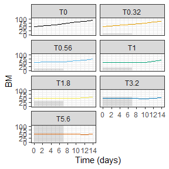
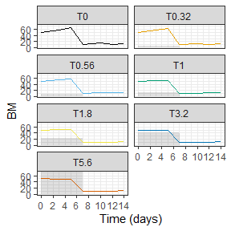

Modeling Howto
================
Nils Kehrein
20 February, 2024

- <a href="#how-to-access-scenario-properties"
  id="toc-how-to-access-scenario-properties">How to access scenario
  properties</a>
- <a href="#using-tidy-syntax" id="toc-using-tidy-syntax">Using
  <em>tidy</em> syntax</a>
- <a href="#predictions" id="toc-predictions">Predictions</a>
- <a href="#moving-exposure-windows"
  id="toc-moving-exposure-windows">Moving exposure windows</a>
- <a href="#simulating-biomass-transfers"
  id="toc-simulating-biomass-transfers">Simulating biomass transfers</a>
- <a href="#fitting-model-parameters"
  id="toc-fitting-model-parameters">Fitting model parameters</a>
- <a href="#changes-in-parameter-values-over-time"
  id="toc-changes-in-parameter-values-over-time">Changes in parameter
  values over time</a>
- <a href="#decrease-assessment-runtime"
  id="toc-decrease-assessment-runtime">Decrease assessment runtime</a>
- <a href="#implementing-custom-models"
  id="toc-implementing-custom-models">Implementing custom models</a>
- <a href="#complete-working-example"
  id="toc-complete-working-example">Complete working example</a>
  - <a href="#setting-up-the-model" id="toc-setting-up-the-model">setting up
    the model</a>
  - <a href="#retrieving-basic-information-from-the-model"
    id="toc-retrieving-basic-information-from-the-model">retrieving basic
    information from the model</a>
  - <a href="#simulating-with-the-model-and-plotting"
    id="toc-simulating-with-the-model-and-plotting">simulating with the
    model, and plotting</a>
  - <a href="#assessing-toxic-effects"
    id="toc-assessing-toxic-effects">assessing toxic effects</a>

This Howto provides instructions on how to address certain modeling
challenges and offers additional details and context for certain
features of the package. A final section provides a complete worked out
example. For a more general overview, please refer to the
[manual](manual.html).

## How to access scenario properties

The package provides a number of `set*()` functions to modify scenario
properties but generally no dedicated functions to inspect or retrieve
properties from a scenario object exist. Although these `get*()` are not
present, all scenario properties can be accessed at any time.

Scenario properties are stored in so-called *slots* within the scenario
objects. A *slot* is the name for an object attribute in *R*. The slots
of an object can be accessed by using the `@` operator. It behaves
similar to the `$` operator on named lists:

``` r
# Create a new scenario object
myscenario <- Lemna_Schmitt()

# Access scenario slots and their default values
myscenario@name         # model name
#> [1] "Lemna_Schmitt"
myscenario@forcings.req   # forcings required for effect calculations
#> [1] "temp" "rad"
myscenario@endpoints    # available effect endpoints
#> [1] "BM" "r"
myscenario@control.req  # are control runs required for effect calculation?
#> [1] TRUE
```

The previous example displays some of the default values of a
*Lemna_Schmitt* scenario. The set of available slots depends on the
model type and is documented in the package help. For instance, scenario
properties shared by all models are documented in the `EffectScenario`
class:

``` r
# Call the help page of the EffectScenario class
?`EffectScenario-class`
```

A scenario class inherits all slots from its ancestors. A notable class
which modifies simulation behavior and provides additional scenario
properties is `Transferable`: it provides capabilities to consider
biomass transfers at defined time points during simulation. Details
about its class slots and functionality are described in the help pages.

``` r
?`Transferable-class`
```

## Using *tidy* syntax

The tidy syntax, popularized by the tidyverse packages in R, provides a
coherent and efficient approach to data manipulation and analysis. The
tidyverse, which includes, for example, the widely used dplyr and
ggplot2 packages, follows a standardized grammar that makes the code
more readable and intuitive. Tidy syntax emphasizes the use of functions
with clear and descriptive names. This makes it easier for users to
understand and reproduce analyses. The `%>%` (pipe) operator is a key
component of tidy syntax and enables fluent and expressive concatenation
of operations. Overall, the introduction of tidy syntax in R improves
code readability, reproducibility, and collaboration, resulting in
maintainable data analysis pipelines.

In brief, the advantages of *tidy R* syntax are:

- a series of statements can be combined to an intuitive workflow using
  the pipeline (`%>%`) operator
- a short cut for the pipe (`%>%`) operator is Ctrl+Shift+M
- pipelines reduce the need for intermediary variables (but thoughtful
  intermediates are recommended)
- *tidy* verbs generally take `list` data types as input and return
  these also as output
- some verbs enrich outputs with additional information, effectively
  extending the output data to a table

``` r
# Create the results of a control run for an existing Lemna model called 
# metsulfuron with a starting biomass value of 50, which corresponds to 
# 50000 fronds.
  metsulfuron %>%
    set_noexposure() %>%  # set no exposure (i.e., a control run)
    set_init(c(BM = 50)) %>%  # set initial biomass
    simulate()
```

## Predictions

TKTD models have both species and substance specificity. If risks are
identified at Tier 1 (standard test species approach) and exposure
duration is expected to be shorter than in standard tests, the simplest
solution is to develop TKTD models for standard test species. However,
if Tier 2A (geometric mean/evidence weighting approach) or Tier 2B
(species sensitivity distribution approach) information is available, it
may be more appropriate to develop TKTD models for a wider range of
species to increase the accuracy of the risk assessment. Validated TKTD
models for these different species can be used as an alternative to
assess specific risks using available field exposure profiles. This
includes the calculation of exposure profile specific LPx/EPx values
(multiplication factor for a specific overall exposure profile causing x
% lethality or effect) based on an appropriate aquatic exposure
assessment.

``` r
# Calculation of EPx values for a complete concentration profile.
  set.seed(123)  # Setting a seed for reproducibility
# Generating a random profile for 15 days with concentrations below 0.1
  random_conc <- runif(15, min = 0, max = 0.1)
  exposure_profile <- data.frame(t = 0:14, c = random_conc)
# run EPx calculations for full exposure profile
  metsulfuron %>%
    set_exposure(exposure_profile) %>%  # set a specific exposure scenario
    epx()  # run EPx calculations
```

## Moving exposure windows

A moving time window is a computing technique used in data analysis.
Data is systematically analysed within a window of fixed size that moves
or slides through the data set in our case an exposure profile. The
window captures a subset of successive data points, and as it moves
through the data, calculations are performed in each window.

``` r
# Calculation of EPx values for a complete concentration profile.
set.seed(123)  # Setting a seed for reproducibility
# Generating a random profile for 15 days with concentrations below 0.1
random_conc <- runif(15, min = 0, max = 0.1)
exposure_profile <- data.frame(time = 0:14, conc = random_conc)
# run EPx calculations for a window length of 7 days and a step size of 1
metsulfuron_epx_mtw <- metsulfuron %>%
  set_exposure(exposure_profile) %>%
  epx_mtw(window_length = 7, 
          window_interval = 1, 
          level = c(10))
metsulfuron_epx_mtw
# The result can be plotted with plot_EPx()
plot_EPx(EPx_ts = metsulfuron_epx_mtw,
         exposure_ts = exposure_profile)
```

`effect()` can report effect levels for all evaluated exposure windows
on demand:

``` r
# Derive effect levels of all exposure windows
metsulfuron %>% effect(max_only=FALSE)
```

The resulting table describes how effect levels change when the exposure
window moves along the exposure series. It is also possible to specify
the marginal effect threshold of reported results (this prevents
overinterpretation of spurious effect levels originating from minuscule
numerical errors introduced during simulation), as in the following
example:

``` r
# Only report effect levels larger than 1e-5 = 0.001%
metsulfuron %>% effect(max_only=FALSE, marginal_effect=1e-5)
```

## Simulating biomass transfers

A transfer refers to an event where a certain amount of biomass (BM) is
moved to a new medium after a period of time. This feature replicates a
procedure occurring e.g. in *Lemna* effect studies and may be necessary
to recreate study results. At each transfer, a defined amount of biomass
is transferred to a new medium. This is modeled by interrupting the
simulation at a transfer time point, modifying the biomass level BM, and
scaling affected compartments according to new biomass levels. Scaling
of compartments depending on biomass, such as internal toxicant mass, is
necessary to correctly reflect mass balances and concentrations over
time.

Option 1: regular intervals

``` r
  metsulfuron %>%
    set_init(c(BM=1)) %>%
    set_noexposure() %>%
    set_transfer(interval = c(3), biomass = 1) %>%
    simulate()
```

Option 2: custom time points and custom biomass

``` r
  metsulfuron %>%
    set_init(c(BM=1)) %>%
    set_noexposure() %>%
    set_transfer(times = c(3,6), biomass = c(1,0.5)) %>%
    simulate()
```

``` r
# Call the help page of set_transfer
?`set_transfer`
```

## Fitting model parameters

Parameters of a model can be fitted (calibrated) against observed effect
data.

The calibration routines are not yet par of the package, but can be
downloaded from Github.

The current workflow for calibration is:

1.  Combine the necessary inputs (model, exposure scenario, effect
    data).
2.  Fit the model for the given exposure scenario(s) and corresponding
    effect dataset(s).

For the first step, two options are available:

- When only one exposure level (e.g., one experimental treatment) and
  corresponding effect dataset (effect data only contain observations
  corresponding to one exposure scenario) are of interest, then the
  `EffectScenario` (which includes the model and one exposure scenario)
  and the effect data can directly be entered into the `calibrate()`
  function.

- Alternatively, one can combine the `EffectScenario` and effect data
  into a `CalibrationSet` object first using the `CalibrationSet()`
  function, and subsequently do the fitting of the model using the
  `calibrate()` function with one or more `CalibrationSet` objects
  (organised into a list) as input.

After calibration, one can, for example, inspect the updated parameter
values, simulate with the updated model, and plot results of these new
simulations

``` r
# Create Effect Scenario
# Get exposure data in the highest treatment level of the Schmitt 2013 study
exp_df <- Schmitt2013 %>%
  dplyr::filter(ID == "T5.6") %>%
  dplyr::select(t, conc)
# Create exposure scenario containing the exposure data in the highest treatment level
exp_scen <- metsulfuron %>%
  set_exposure(exp_df)
# Get corresponding effect data from the Schmitt 2013 study
# Observed effects in the highest treatment level
eff_df <- Schmitt2013 %>%
  dplyr::filter(ID == "T5.6") %>%
  dplyr::select(t, obs)
```

Option 1: direct calibration with 1 EffectScenario + 1 effect dataset

``` r
# Option 1: direct calibration with 1 EffectScenario + 1 effect dataset
fit1 <- calibrate(
  x = exp_scen,  # exposure scenario containing the exposure of the Schmitt 2013 study 
  par = c(k_phot_max = 1, k_resp = 0.1),
  data = eff_df, # observed effect data from the Schmitt 2013 study
  endpoint = "BM"
)
fit1$par
# Update exposure scenario  with new parameter values
metsulfuron2 <- metsulfuron %>%
  set_param(fit1$par)
# Look at new parameters of the exposure scenario
metsulfuron2@param$k_phot_max
metsulfuron2@param$k_resp
# simulate with updated model
# treatments in long format
treatments <- data.frame(time = Schmitt2013$t,
                         trial = Schmitt2013$ID,
                         conc = Schmitt2013$conc)
rs_mean <- simulate_batch(
  model_base = metsulfuron2,
  treatments = treatments,
  param_sample = NULL
)
# observations in long format
obs_mean <- data.frame(time = Schmitt2013$t,
                       trial = Schmitt2013$ID,
                       data = Schmitt2013$obs)
# plot results
plot_sd(
  model_base = metsulfuron2,
  treatments = treatments,
  rs_mean = rs_mean,
  obs_mean = obs_mean
)
```

Option 2: create `CalibrationSet` before calibration, and then calibrate
on a list of `CalibrationSets` Create list of CalibrationSets

``` r
# get all the exposure scenarios from the Schmitt 2013 study
list_eff_scen <- Schmitt2013 %>%
  dplyr::group_by(ID) %>%
  dplyr::group_map(~ metsulfuron %>%
                     set_exposure(data.frame(.x$t, .x$conc)))
# get all the observed effect data from the Schmitt 2013 study
list_eff_data <- Schmitt2013 %>%
  dplyr::group_by(ID) %>%
  dplyr::group_map(~ data.frame(.x$t, .x$obs))
list_calib_sets <- list()
for (i in seq_along(list_eff_scen)) {
  list_calib_sets[[i]] <- CalibrationSet(list_eff_scen[[i]], list_eff_data[[i]])
}
# Calibrate
fit2 <- calibrate(
  x = list_calib_sets,
  par = c(k_phot_max = 5, k_resp = 0.8),
  endpoint = "BM"
)
fit2
```

## Changes in parameter values over time

ScenarioSequence() creates an object of the ScenarioSequence class,
which contains a sequence of several EffectScenarios. Along this
sequence of EffectScenarios, details of the experiment (i.e., the
exposure scenario) can change. Indeed, sometimes, experimental
conditions change during the course of the experiment, which should not
be captured by the model (e.g., a pump failure, or the removal of some
experimental organisms from the system to avoid overcrowding).

``` r
# parameter change occurs at day 7
seq7 <- list(metsulfuron %>% set_times(0:7),
            metsulfuron %>% set_times(7:8),
            metsulfuron %>% set_times(8:14))
simulate(ScenarioSequence(seq7))
```

``` r
# Call the help page of ScenarioSequence
?`ScenarioSequence-class`
```

## Decrease assessment runtime

There are ways to decrease the runtime of a simulation. One possibility
is to reduce the maximum step length of the solver by setting the
optional argument `hmax`. The larger `hmax`, the faster the simulations.
But be careful, the larger hmax, the greater the risk that the results
will be inaccurate. Especially for the simulation of long periods of
time, such as annual exposure profiles, the results may be inaccurate.
Oftentimes, it will be computational more efficient to adapt the
solver’s error tolerances `atol` and `rtol` than reducing the step width
`hmax` to achieve stable numerics. Start by decreasing deSolve’s default
values by orders of ten until the simulation yields acceptable results,
see e.g. ?deSolve::lsoda() for more information on error tolerances.

``` r
# Simulations with a maximum solver step length of hmax=0.01
metsulfuron %>%
  set_times(0:7) %>%
  simulate(hmax=0.1)
#>   time       BM E    M_int     C_int  FrondNo
#> 1    0 50.00000 1   0.0000 0.0000000 500000.0
#> 2    1 52.15858 1 223.0745 0.2560989 521585.8
#> 3    2 52.43495 1 369.6344 0.4221192 524349.5
#> 4    3 52.33917 1 463.0261 0.5297392 523391.7
#> 5    4 52.17923 1 521.8927 0.5989176 521792.3
#> 6    5 52.00016 1 558.6268 0.6432808 520001.6
#> 7    6 51.81403 1 581.2187 0.6717006 518140.3
#> 8    7 51.63740 1 474.0716 0.5497473 516374.0
```

## Implementing custom models

The set of supported models can be extended as needed. Additional models
can be added to the package itself if they are considered mature and are
not expected to evolve over time. By contrast, experimental or one-time
use models can be implemented in a user’s script and inserted into the
package’s workflow as well.

The starting point to add a new model is an implementation of the
model’s rules and dynamics in *R* code. In most cases, this will be a
code snippet which describes the model’s Ordinary Differential Equations
(ODE):

``` r
## An exemplary implementation of the GUTS-RED-SD TKTD model ##
# Model ODEs following the deSolve specification
sd_ode <- function(t, state, params) {
  with(as.list(c(state, params)), {
    dDw <- kd * (Cw(t) - Dw)            # dDw/dt, scaled damage
    dH <- kk * max(0, Dw - z)           # dH/dt, cumulative hazard
    
    list(c(dDw, dH))                    # return derivatives
  })
}
```

The previous example implements the model equations in a way that can be
processed by the `deSolve` package for numerical integration. For a
detailed description on how to use `deSolve`, please refer to its
vignette:

``` r
vignette("deSolve", package="deSolve")
```

With some additional scenario data such as initial state, output time
points, and model parameters, we are able to simulate our custom TKTD
model:

``` r
## Properties of a sample scenario ##
init <- c(Dw=0, H=0)                         # initial state
times <- 0:5                                 # output time points [0,5]
param <- c(kd=22, hb=0.01, z=0.5, kk=0.08)   # model parameters
exp <- data.frame(time=0:5,                  # exposure time-series
                  conc=c(0,1,1,0.5,0.6,0.2))

# Create a linear interpolation of the exposure time-series
expf <- approxfun(x=exp$time, y=exp$conc, method="linear", rule=2)
# Extend parameter set by interpolated exposure series
paramx <- as.list(c(param, Cw=expf))

# Numerically solve the ODE
deSolve::ode(y=init, times=times, parms=paramx, func=sd_ode)
#>   time        Dw           H
#> 1    0 0.0000000 0.000000000
#> 2    1 0.9545447 0.008266888
#> 3    2 0.9999995 0.048101596
#> 4    3 0.5227279 0.069837063
#> 5    4 0.5954544 0.073573877
#> 6    5 0.2181819 0.074888021
```

When we have made sure that our custom model can be simulated and works
as expected, we can continue with integrating it into the package’s
workflow. First, we will define a new scenario class that identifies our
custom model by a unique name. Next, we have to tell the package how the
models of this class can be simulated. In a final step, we may have to
describe how effects are calculated for these models.

We start by defining a new scenario class that derives from a suitable
ancestor. In general, we can inherit from the base class
`EffectScenario` which provides the general scenario capabilities.
However, if the custom model is just a variant of an existing model
category, then it will be easier to derive from specialized scenario
class that already provides certain features such as effect calculation.
The following class tree gives an overview of the scenario classes in
use:

    EffectScenario
    |    
    |   Transferable
    |___|__ Lemna
    |   |   |__ LemnaSchmittScenario
    |   |   |__ LemnaSetacScenario
    |   |
    |   |__ Myriophyllum
    |   |   |__ MyrioExpScenario
    |   |   |__ MyrioLogScenario
    |   |
    |   |__ Algae
    |       |__ AlgaeWeberScenario
    |       |__ AlgaeScaledScenario
    |       |__ AlgaeSimpleScenario    
    |
    |__ GutsRedSd
    |__ GutsRedIt
    |
    |__ DebScenario
        |__ DebAbj
        |__ DebDaphnia

To give an example, to implement a variant of a *Lemna* model, it would
be advisable to derive from the class `Lemna` to benefit from already
implemented features such as effect endpoint calculation and simulation
of biomass transfers. For the custom GUTS-RED-SD model, the ideal choice
would be to derive from `GutsRedSd` to minimize the implementation
overhead. However, we will derive from the general `EffectScenario`
class for the sake of our example and create a scenario object:

``` r
## Integrate a new model class into the package workflow ##
# Create a unique class that derives from 'EffectScenario'
setClass("MyGuts", contains="EffectScenario")

# Create an object of the new class and assign scenario properties
new("MyGuts", name="My custom model") %>%
  set_init(init) %>%
  set_times(times) %>%
  set_param(param) %>%
  set_exposure(exp, reset_times=FALSE) %>%
  set_endpoints("L") -> myscenario

myscenario
#> EffectScenario object
#> model: My custom model 
#> param: kd=22, hb=0.01, z=0.5, kk=0.08
#> init : Dw=0, H=0
#> endpt: L
#> times: [0,5] n=6, regular
#> forcs: none
#> expsr: none
#>   time conc
#> 1    0  0.0
#> 2    1  1.0
#> 3    2  1.0
#> 4    3  0.5
#> 5    4  0.6
#> 6    5  0.2
```

The object `myscenario` now carries all the settings and data which we
also used for our test simulation. In the next step, the `solver()`
function will be overloaded to handle objects of the newly defined
scenario class `MyGuts`. The adapted `solver()` function will collect
the properties of a given scenario object, call the ODE solver, and
return simulation results:

``` r
# the actual function calling deSolve can have a different signature
solver_myguts <- function(scenario, times, ...) {
  # overriding output times by function argument must be possible
  if(missing(times))
    times <- scenario@times
  
  # get relevant data from scenario
  init <- scenario@init
  param <- scenario@param
  exp <- scenario@exposure@series
  if(nrow(exp) == 1) { # extend exposure series to have at least two rows
    row2 <- exp[1,]
    row2[[1]] <- row2[[1]]+1
    exp <- rbind(exp, row2)
  }
  
  # Create a linear interpolation of the exposure time-series
  expf <- approxfun(x=exp[,1], y=exp[,2], method="linear", rule=2)
  # Extend parameter set by interpolated exposure series
  paramx <- as.list(c(param, Cw=expf))
  
  as.data.frame(deSolve::ode(y=init, times=times, parms=paramx, func=sd_ode, ...))
}

## Overload the simulate() function ##
# The functions signature, i.e. the number and names of its arguments, must stay as is
setMethod("solver", "MyGuts", function(scenario, times, ...) solver_myguts(scenario, times, ...))
```

Overloading an *S4* function is done using `setMethod()`. The first
argument to `setMethod()` identifies which function we want to overload,
in this case it is `solver`. The second argument, `MyGuts`, defines
which object type our overloaded function will accept. In this case, we
want to provide an implementation to simulate `MyGuts` scenarios. *R*
will decide during runtime which of the function candidates to execute
when `solver()` is called based on the type of the first argument to
`solver()`. The third argument,
`function(object, ...) solver_myguts(scenario=object, ...)` forwards
calls to an appropriate function which can handle `MyGuts` objects. The
function signature `function(object, ...)` must stay exactly as it is
and must not be modified.

The code within the body of `solver_myguts()` is almost identical to the
original code used to simulate the prototyped model. We have to deal
with one corner case, though: some exposure time-series will contain
only a single row, representing constant exposure over time, but this
would raise an error in `approxfun()`. In order to avoid this error, we
will duplicate the first row and append it to the series. Technically,
this issue should be handled in the prototyped code as well but was left
out for reasons of brevity.

The parameterized scenario object `myscenario` of class `MyGuts` can be
passed to the overloaded `simulate()` function:

``` r
myscenario %>% simulate()
#>   time        Dw           H
#> 1    0 0.0000000 0.000000000
#> 2    1 0.9545447 0.008266888
#> 3    2 0.9999995 0.048101596
#> 4    3 0.5227279 0.069837063
#> 5    4 0.5954544 0.073573877
#> 6    5 0.2181819 0.074888021
```

The custom model can now be simulated using the framework but it is
still missing effect endpoints. If, on the other hand, we had decided to
inherit our scenario class from a suitable ancestor, such as
`GutsRedSd`, we could have stopped at this point as the ancestor would
provide routines to calculate effects.

By default, any state variable is available as an effect endpoint and
the calculated effect would reflect the change in the state variables’
value at the end of the simulation. However, we need to calculate the
*survival* endpoint in a different manner for GUTS-RED type models. To
implement this specialized endpoint, we need to overload the function
`fx()` which calculates effect endpoints:

``` r
## Overload effect endpoint calculation ##
# fx() is called by effect()
setMethod("fx", "MyGuts", function(scenario, ...) fx_myguts(scenario, ...))

# @param scenario Scenario object to assess
# @param window Start & end time of the moving exposure window
# @param ... any additional parameters
fx_myguts <- function(scenario, window, ...) {
  # simulate the scenario (it is already clipped to the moving exposure window)
  out <- simulate(scenario, ...)
  # only use model state at the end of the simulation
  out <- tail(out, 1)
  # calculate survival according to EFSA Scientific Opinion on TKTD models
  # p. 33, doi:10.2903/j.efsa.2018.5377
  t <- unname(window[2] - window[1])
  survival <- exp(-out$H) * exp(-scenario@param$hb * t)
  return(c("L"=survival))
}

# Derive effect levels for our sample scenario
myscenario %>% effect()
#> # A tibble: 1 × 4
#>   scenario      L L.dat.start L.dat.end
#>   <list>    <dbl>       <dbl>     <dbl>
#> 1 <MyGuts> 0.0722           0         5
```

`fx()` is used by `effect()` to derive effect endpoints for each model.
By convention, any overload of the `fx()` function must return a named
numerical vector containing the effect endpoints for the provided
scenario and moving exposure window. The scenario will already be
parameterized to only simulate the current exposure window. The return
value of `fx()` will then be used to calculate effect levels. In case of
models requiring a control scenario, the effect level will be calculated
as `1 - effect/control`. For models not requiring a control, the
overloaded `fx()` must return the final effect level, i.e. a value from
the interval `[0,1]` (0% to 100% effect).

## Complete working example

In this section, a complete example is given to make predictions and
evaluate toxic effects using a calibrated model, as might be conducted
in a risk assessment context. Specifically, the *Lemna* model will be
set up to match the study of Schmitt et al. (2003, doi:
10.1016/j.ecolmodel.2013.01.017) who exposed *Lemna* to
metsulfuron-methyl.

The model will be parameterized with the values as described in the
study. Then, the model will be inspected and used to make predictions
for exposure scenarios, plot results, and get EPx calculations.

### setting up the model

Setting up the model (i.e. creating an `EffectScenario`) involved
defining the parameters, the environmental variables (external forcings
and chemical exposure), and the initial conditions. Further, a tag can
be given to easily identify and retrieve the `EffectScenario` by name.
Also, for primary producer models, a transfer of biomass can be defined
matching with the experimental design of the study.

``` r
## Get all model parameters
# algae model parameters taken from file 'mm2.r' included
# in supporting material of Schmitt et al. (2013)
param_study <- list(
  #     - Effect -
  Emax     = 0.784,   # [same as conc. data]  maximum effect concentration
  EC50     = 0.3,     # [same as conc. data]  Midpoint of effect curve
  b        = 4.16,    # [-]  Slope of effect curve
  #     - Toxicokinetics -
  P_up     = 0.0054,  # [cm/d]  Permeability for uptake
  AperBM   = 1000,    # [cm^2/g_dw]  Frond area/dry weight
  Kbm      = 0.75,    # []  Biomass(fw)-water partition coefficient
  P_Temp   = F,       # Switch for temperature dependence of cuticle permeability
  MolWeight = 381,    # [g/mol] Molmass of molecule (determines Q10_permeability)
  #     - Fate of biomass -
  k_phot_fix  = F,    # If True k_G_max is not changed by environmental factors
  k_phot_max  = 0.47, # [1/d]  Maximum photosynthesis rate
  k_resp   = 0.05,    # [1/d]  Respiration rate at ref. temperature
  k_loss   = 0.0,     # [1/d]  Some rate of loss (e.g. Flow rate)
  #     - Temperature dependence -
  Tmin     = 8.0  ,   # [°C]  Minimum growth temperature 
  Tmax     = 40.5 ,   # [°C]  Maximum growth temperature
  Topt     = 26.7 ,   # [°C]  Optimum growth temperature 
  t_ref    = 25,      # [°C]  Reference temperature for respiration rate
  Q10      = 2,       # [-]   Temperature dependent factor for respiration rate
  #     - Light dependence (Linear) -
  k_0      = 3 ,      # [1/d]  Intercept of linear part
  a_k      = 5E-5 ,   # [(1/d)/(kJ/m^2/d)]   Slope of linear part
  #     - Phosphorus dependence (Hill like dependence) -
  C_P      = 0.3,     # [mg/L]  Phosporus concentration in water
  CP50     = 0.0043,  # [mg/L]  P-conc. where growth rate is half
  a_P      = 1,       # []  Hill coefficient
  KiP      = 101,     # [mg/L]  P-inhibition constant for very high P-conc.
  #     - Nitrogen dependence (Hill like dependence) -
  C_N      = 0.6,     # [mg/L]  Nitrogen concentration in water
  CN50     = 0.034,   # [mg/L]  N-conc. where growth rate is half
  a_N      = 1,       # []  Hill coefficient
  KiN      = 604,     # [mg/L]  n-inhibition constant for very high P-conc.
  #     - Density dependence -
  BM50     = 176,     # [g_dw/m^2] Cut off BM
  #     - Others -
  mass_per_frond = 0.0001,  # [g_dw/frond]  Dry weight per frond
  BMw2BMd  = 16.7     # [g_fresh/g_dry]  Fresh- / dryweight 
)


## Define the forcing variables
forc_temp <- data.frame(t = 0, tmp = 12) # [°C]  Current temperature (may also be a table)
forc_rad  <- data.frame(t = 0, rad = 15000) # [kJ/m²/d]  Radiation  (may also be given as table)


## Define a simple exposure pattern
# t 0..6  concentration 1 ug/L
# t 7..14 concentration 0 ug/L
exposure <- data.frame(time = 0:14, 
                       conc = c(rep(1, 7), rep(0, 8))
                       )


## Set initial values 
# given in file 'mmc2.r' of Schmitt et al. (2013)
init <- c(
  BM       = 50,     # [g_dw/m^2]  Dry Biomass dry weight per m2
  E        = 1,      # (0-1)  (Toxic) Effect = Factor on growth rate  (Range: 0 - 1, 1=no effect)
  M_int    = 0       # [ug]   Amount of toxicant in biomass
)

## create an EffectScenario object, containing the model (with parameters) and the exposure scenario
Lemna_Schmitt() %>%               # the Lemna model
  set_tag("metsulfuron") %>%      # set a tage for the specific implementation of the model
  set_init(init) %>%              # set the starting values (as prepared above)
  set_param(param_study) %>%      # set the parameters (as prepared above)
  set_exposure(exposure) %>%      # set the exposure scenario (exposure time series)
  set_forcings(temp=forc_temp, rad=forc_rad) -> metsulfuron # set the external forcing 
# variables, and save everything as an object
```

### retrieving basic information from the model

All scenario properties can be investigated (see help file for available
properties: ?EffectScenario())

``` r

## overall summary
metsulfuron
#> EffectScenario object
#> model: Lemna_Schmitt (#metsulfuron)
#> param: Emax=0.784, AperBM=1000, Kbm=0.75, P_Temp=0, MolWeight=381, k_phot_fix=0, k_phot_max=0.47, k_resp=0.05, k_loss=0, Tmin=8, Tmax=40.5, Topt=26.7, t_ref=25, Q10=2, k_0=3, a_k=5e-05, C_P=0.3, CP50=0.0043, a_P=1, KiP=101, C_N=0.6, CN50=0.034, a_N=1, KiN=604, BM50=176, mass_per_frond=1e-04, BMw2BMd=16.7, EC50=0.3, b=4.16, P_up=0.0054
#> init : BM=50, E=1, M_int=0
#> endpt: BM, r
#> times: [0,14] n=15, regular
#> forcs: temp, rad
#> expsr: none
#>    time conc
#> 1     0    1
#> 2     1    1
#> 3     2    1
#> 4     3    1
#> 5     4    1
#> 6     5    1
#> 7     6    1
#> 8     7    0
#> 9     8    0
#> 10    9    0
#>  [ reached 'max' / getOption("max.print") -- omitted 5 rows ]

## Access specific scenario properties
# names
metsulfuron@name       # check model name 
#> [1] "Lemna_Schmitt"
metsulfuron@tag        # check tag for specific model implementation
#> [1] "metsulfuron"
# parameters and endpoints
metsulfuron@param      # check parameters and their values
#> $Emax
#> [1] 0.784
#> 
#> $AperBM
#> [1] 1000
#> 
#> $Kbm
#> [1] 0.75
#> 
#> $P_Temp
#> [1] FALSE
#> 
#> $MolWeight
#> [1] 381
#> 
#> $k_phot_fix
#> [1] FALSE
#> 
#> $k_phot_max
#> [1] 0.47
#> 
#> $k_resp
#> [1] 0.05
#> 
#> $k_loss
#> [1] 0
#> 
#> $Tmin
#> [1] 8
#> 
#> $Tmax
#> [1] 40.5
#> 
#> $Topt
#> [1] 26.7
#> 
#> $t_ref
#> [1] 25
#> 
#> $Q10
#> [1] 2
#> 
#> $k_0
#> [1] 3
#> 
#> $a_k
#> [1] 5e-05
#> 
#> $C_P
#> [1] 0.3
#> 
#> $CP50
#> [1] 0.0043
#> 
#> $a_P
#> [1] 1
#> 
#> $KiP
#> [1] 101
#> 
#> $C_N
#> [1] 0.6
#> 
#> $CN50
#> [1] 0.034
#> 
#> $a_N
#> [1] 1
#> 
#> $KiN
#> [1] 604
#> 
#> $BM50
#> [1] 176
#> 
#> $mass_per_frond
#> [1] 1e-04
#> 
#> $BMw2BMd
#> [1] 16.7
#> 
#> $EC50
#> [1] 0.3
#> 
#> $b
#> [1] 4.16
#> 
#> $P_up
#> [1] 0.0054
metsulfuron@param.req  # check which parameters are required
#>  [1] "Emax"           "EC50"           "b"              "P_up"           "AperBM"         "Kbm"            "P_Temp"         "MolWeight"      "k_phot_fix"     "k_phot_max"     "k_resp"        
#> [12] "k_loss"         "Tmin"           "Tmax"           "Topt"           "t_ref"          "Q10"            "k_0"            "a_k"            "C_P"            "CP50"           "a_P"           
#> [23] "KiP"            "C_N"            "CN50"           "a_N"            "KiN"            "BM50"           "mass_per_frond" "BMw2BMd"
metsulfuron@endpoints
#> [1] "BM" "r"
# experimental conditions
metsulfuron@forcings
#> $temp
#>   t tmp
#> 1 0  12
#> 
#> $rad
#>   t   rad
#> 1 0 15000
metsulfuron@exposure@series
#>    time conc
#> 1     0    1
#> 2     1    1
#> 3     2    1
#> 4     3    1
#> 5     4    1
#> 6     5    1
#> 7     6    1
#> 8     7    0
#> 9     8    0
#> 10    9    0
#> 11   10    0
#> 12   11    0
#> 13   12    0
#> 14   13    0
#> 15   14    0
```

### simulating with the model, and plotting

``` r
## simulate with model, under a range of different exposure scenarios
# create several exposure scenarios
exp_scen <- data.frame(time = Schmitt2013$t,
                       trial = Schmitt2013$ID,
                       conc = Schmitt2013$conc)
# simulate for all these scenarios
results <- simulate_batch(
  model_base = metsulfuron,
  treatments = exp_scen,
  param_sample = NULL
)
# plot results
plot_sd(
  model_base = metsulfuron,
  treatments = exp_scen,
  rs_mean = results,
)
```



``` r


## simulate with model, under a range of different exposure scenarios, and including 
## a biomass transfer
# simulate for all scenarios
results <- metsulfuron %>%
  set_transfer(interval = c(5), biomass = 10) %>% # implement a biomass transfer every 5 days
  simulate_batch(treatments = exp_scen)
# plot results
plot_sd(
  model_base = metsulfuron,
  treatments = exp_scen,
  rs_mean = results,
)
```



### assessing toxic effects

``` r
## Calculation of EPx values for a complete concentration profile.
set.seed(123)  # Setting a seed for reproducibility

# run EPx calculations for full exposure profile
metsulfuron %>%
  set_exposure(exp_scen %>% # set a specific exposure scenario
                 dplyr::filter(trial == "T5.6") %>% 
                 dplyr::select(time,conc)) %>%  
  epx(level = c(10,30))  # run EPx calculations
#> # A tibble: 1 × 5
#>   scenario   BM.EP10 r.EP10 BM.EP30 r.EP30
#>   <list>       <dbl>  <dbl>   <dbl>  <dbl>
#> 1 <LmnSchmS>  0.0673 0.0557   0.188 0.0870
```
